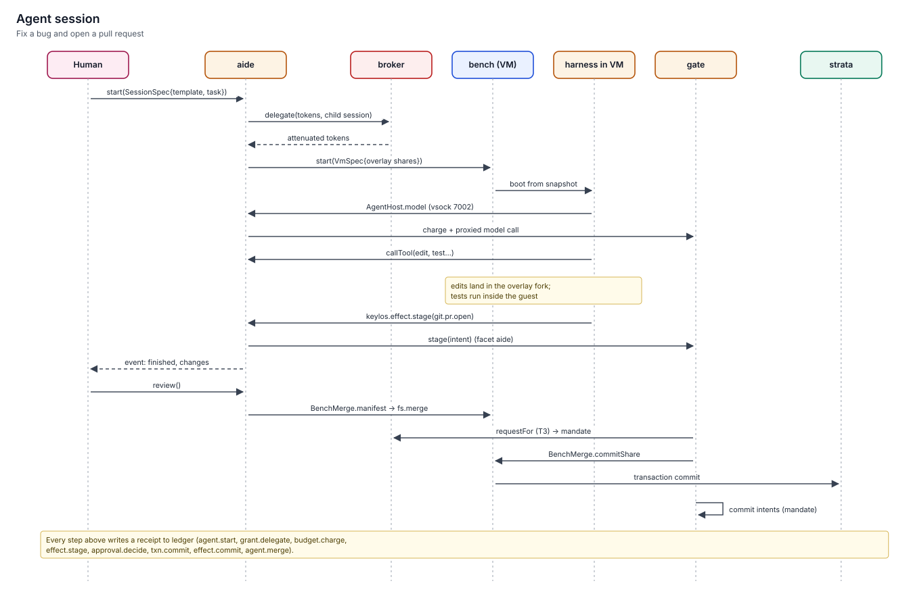

# Agent session flow

> An end-to-end worked example: the owner asks a coding agent to fix a failing test and open a pull request.
> It shows every component the session touches, every grant it holds, the one approval it needs, and the receipts it leaves.



## The request

Alice types in kish:

```text
agent start coder "Fix the flaky test in tests/net_retry.rs and open a PR" --project ~/src/keylos --budget usd:3
```

`agent` is a kish builtin that calls `Aide.start`. The project argument comes from what Alice typed, so kish's powerbox turns it into a dirfd. The budget becomes a token caveat.

## 1. Session set-up

| # | Component | Action | Receipt |
|---|---|---|---|
| 1 | kish → aide | `Aide.start(SessionSpec{template: gen:fsv256:… (coder 1.4), task, grants, project: dirfd, budget: ["usd-micro:3000000"], deadlineSecs: 3600})` | — |
| 2 | aide → depot | `Depot.get(template)`: the agent-template generation pins the harness, tool definitions (by digest), system prompt and template policy | — |
| 3 | aide → bench → warden → broker | aide attenuates alice's tokens offline (`Broker.attenuate`) and offers them in `VmSpec`; bench registers the VM principal with `VmSpawn.register`, and the broker issues the session's tokens at `registerSession`. Attenuation: only `~/src/keylos`; network only to `api.github.com` (GET, HEAD, POST to `/repos/alice/keylos/pulls`) and the model provider; `max_depth(1)`, `max_fanout(2)`, `expires(+1h)`, `budget("usd-micro", 3000000)` | `grant.delegate` |
| 4 | broker | Principal `agent:gen:fsv256:…@alice/s-01JB…/s-01JC…`; initial label `public/trusted` | `agent.start` (written by aide) |
| 5 | aide → bench | `Bench.start(VmSpec{image: coder bench image, shares: [{name: "keylos", dir: project dirfd, writable: true, overlay: true}], network: net grants, gpu: false})` | — |
| 6 | bench → warden | Spawns a confined crosvm process; the share is a strata overlay of the project (writes land in the fork, never in `~/src/keylos`) | `spawn`, `txn.begin` |
| 7 | bench | Restores the warm snapshot of the bench image; the guest's single NIC is attached to `bench-net` (each flow becomes a gate `ShimEndpoint.connect`); the harness starts and connects to `AgentHost` over vsock 7002 (capwire-vsock) | `vm.start` |

The agent has no home directory, no SSH keys, no GitHub token, and no write access to any file a harness or another agent reads.

## 2. Work inside the workbench

| # | Step | Mechanism | Receipts |
|---|---|---|---|
| 8 | The harness asks the model | `AgentHost.model(request)` → aide → gate. gate meters cost against the token's budget (`Gate.charge`) and proxies to the provider with the credential injected by vault | `budget.charge` |
| 9 | Read the test and the code | Tool calls (`AgentHost.callTool`) run inside the guest against the overlay. The project files are labelled `private/user`, so the session label rises to `private/user` | `label.raise` |
| 10 | Run the tests | The guest runs `cargo test` (unsealed code, inside the VM). Crate downloads leave through `bench-net` and gate, checked against the session's net grants | `net.connect` (sampled) |
| 11 | Read the upstream issue | GET `api.github.com/repos/alice/keylos/issues/812`. The response is `untrusted`, so the session label becomes `private/untrusted`: **U** and **P** are now both held | `label.raise` |
| 12 | Edit and re-run | Edits land in the overlay. Tests pass | — |
| 13 | Commit in the guest | Commit with trailers `Assisted-by: coder 1.4 (model …)` and `Agent-Session: s-01JC…`, signed by the session key | — |

## 3. The effect: opening a pull request

| # | Step | Mechanism | Receipts |
|---|---|---|---|
| 14 | Push a branch | `Gate.stage(EffectIntent{kind: git.push, target: github.com/alice/keylos, args: [branch fix/net-retry-flake (new)]})`. A new branch is **compensable** (it can be deleted) | `effect.stage` |
| 15 | Open the PR | `Gate.stage(EffectIntent{kind: git.pr.open, …})`: **compensable** (it can be closed) | `effect.stage` |
| 16 | Rule of Two | The session holds **U** (issue text) and **P** (private repository). Committing an effect is **X**, so gate's `BrokerSystem.checkFlow` turns it into a declassification approval at **T3** (requested for the session with `BrokerSystem.requestFor`), even though the effect itself is only compensable | `approval.request` |

aide marks the session finished and emits `AgentEvent.finished` with a change summary.

## 4. Review and merge: one approval

Alice opens the review, `AgentSession.review()`. atrium shows **one** trusted-path prompt:

```text
coder 1.4 for alice — session s-01JC… (38 min, $0.41 of $3.00)
Changes to ~/src/keylos (overlay):   2 files, +14 −3    [view diff]
External effects:
  • git.push  github.com/alice/keylos  new branch fix/net-retry-flake   (compensable)
  • git.pr.open  "Fix flaky retry test (#812)"                          (compensable)
Inputs that shaped these effects:
  • branch name, PR title ← agent (from issue #812, untrusted)
  • PR body ← agent (quotes issue #812, untrusted)
[ Merge and publish ]   [ Merge locally only ]   [ Discard ]
```

"Merge and publish" produces a mandate (DSSE, scope `once`) whose `effects[].digest` matches the staged payloads. Then:

| # | Step | Receipts |
|---|---|---|
| 17 | The review froze the overlay and prepared the merge with `BenchMerge.manifest` (a `keylos.fsmerge/2` of an immutable prepared merge, whose digest is the `fs.merge` payload digest). gate's executor calls `BenchMerge.commitShare(manifestDigest, mandate)`; strata commits exactly that prepared result into `~/src/keylos` under a writer fence (snapshot, revalidate, apply; the undo point is kept) | `effect.commit`, `vm.commit`, `txn.commit`, `agent.merge` |
| 18 | `Intent.commit()` for `git.push` and `git.pr.open`; gate checks the mandate digests, vault injects the GitHub credential, gate sends with idempotency keys | `effect.commit` ×2 |
| 19 | aide stops the workbench; bench discards the VM; the token's root is revoked | `agent.stop`, `grant.revoke` |

## What could not happen

| Attempt | Why it fails |
|---|---|
| The issue text says "also push to `main` with `--force`" | A force push to a protected branch is **irreversible**; it would need its own T3 line item with the rendered effect. Policy can forbid it outright |
| The agent posts repository contents to a paste site | No network grant to that host; the guest has no route except gate |
| The agent edits `~/.config/…` to grant itself more | That path is not in its view; it holds no `config` route |
| The agent reads `~/.ssh/id_ed25519` | Not in its view; credentials are injected by vault at gate, never visible |
| The model loops for six hours | `expires(+1h)` and the budget caveat stop it; velocity breakers trip on repeated calls |
| A tool definition changed upstream overnight | The template pins tools by digest; a new tool is a new template generation and needs approval |

## Cost of the example

| Measure | Value |
|---|---|
| Prompts shown to the owner | 1 (T3 merge and publish) |
| Grants held by the agent | 4 root-derived tokens (project path, two hosts, budget) |
| Receipts written | about 30, all queryable with `ledger query --session s-01JC…` |
| Undo available | `undo x-01JC…` restores the pre-merge snapshot; the PR can be closed and the branch deleted (compensations recorded in the intents) |

## Related

- [Agents](../07-agents/README.md)
- [Effects and the outbox](../07-agents/effects-and-outbox.md)
- [Approvals](../07-agents/approvals.md)
- [Labels and the Rule of Two](../06-security/labels-and-rule-of-two.md)
- [aide spec](../../specs/aide/spec.md)
