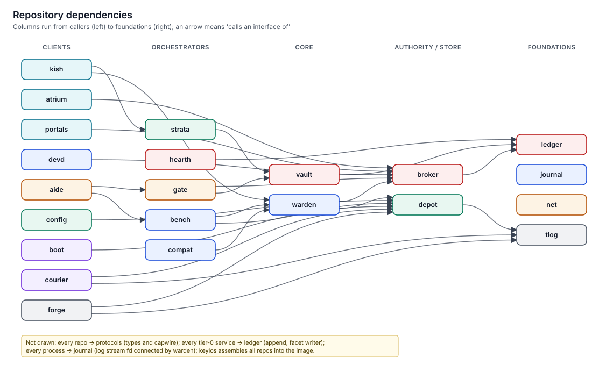

# Dependency rules

> Which component may call which interface, through which facet. Routes are declared in manifests and enforced by warden, so a call that is not in this table cannot happen.
> The graph has no cycles; evidence flows one way into the ledger.



## How dependencies are enforced

- **At build time.** Every repository depends only on the `keylos-protocols` crates. It never depends on another repository's code, and no repository links another.
- **At run time.** A process can reach a service only through a socket that warden created for a **route** declared in the caller's manifest and allowed by policy (see [protocols §7.2](../../specs/protocols/spec.md#72-routes-and-facets)). The service learns the caller's principal and **facet** from `ServiceHost.accept` (or `Supervisor.connectionInfo`), and exposes only that facet's methods. Runtime service grants are wired by broker through `ServiceConnect.connectService`.
- **Facets** narrow an interface per caller class. For example, `Vault.dataKey` and `Vault.forget` exist only on the `strata`, `gate`, `ledger` and `aide` facets (each for its own unit prefix), and `Ledger.append` only on the `writer` facet.

## Route table

Routes are written `service#facet`. The normative registry of every facet, its holders and its methods is [protocols §19.2](../../specs/protocols/spec.md#192-facets) ([Registries](../04-contracts/registries.md#facets)); this table groups the same routes by caller.

| Caller | Routes (`service#facet`) | Purpose |
|---|---|---|
| every principal | `warden#client`, `broker#principal`, `ledger#reader`, `devd#client`, `journal#client` | Spawn children, request and materialise grants, read own receipts, device lists, logs |
| apps (per manifest `needs.*`) | `vault#app`, `gate#client`, `portal-*#default`, `strata#user`, `depot#user` | Own secrets, egress and staged effects, portals, transactions |
| owner `shell` | `warden#admin`, `ledger#admin`, `vault#admin`, `hearth#admin`, `gate#admin`, `config#owner`, `depot#admin`, `courier#admin`, `strata#admin`, `journal#admin`, `devd#admin`, `bench#admin`, `compat#admin`, `aide#admin` | Administration; presence-class actions still need a touch |
| kish | `strata#user`/`#cli`, `bench#user`, `compat#user`, `gate#client`, `depot#user`, `vault#app` | `try`, `work`, legacy commands, `effects`, `seal`, secrets |
| warden | `broker#system`, `depot#mounter`, `strata#warden`, `journal#warden`, `net#plumbing`, `ledger#time`, `ledger#writer`, `devd#warden`, `hearth#system`, `atrium#display` | Session registration, mounts, transaction views, log streams, egress UIDs, time floor, receipts, device plans |
| broker | `warden#broker`, `atrium#approve`, `hearth#presence`, `portal-files#broker`, `devd#broker`, `gate#broker`, `vault#broker`, `fleet#decider`, `ledger#writer` | Grant mounts, process control, approvals, presence, powerbox, materialisation back ends, org approvals |
| gate | `broker#system`, `broker#label-authority`, `vault#gate`, `net#resolver`, `net#plumbing`, `bench#merge`, `fleet#gate`, `ledger#writer` | Rule-of-Two checks, `requestFor`, labels, credential injection, DNS, listen ports, overlay merges, compliance tokens |
| aide | `bench#aide`, `bench#merge`, `gate#aide`, `gate#meter`, `broker#system`, `broker#label-authority`, `strata#aide`, `vault#aide`, `config#propose`, `ledger#writer` | Workbenches, staging and metering, session keys, overlays, proposals |
| harness in an agent VM | `aide#host` (vsock 7002) | Tools, models, events, grant requests |
| bench | `warden#bench`, `depot#mounter`, `strata#bench`, `gate#shim` (one per VM, through `bench-net`), `broker#label-authority`, `aide#grant-delegate`, `net#captive`, `atrium#display` | crosvm and device processes, images, share transactions, egress, labels on virtio-fs opens, tier-2 windows |
| compat | `warden#compat`, `depot#compat`, `depot#mounter`, `bench#compat`, `strata#compat`, `vault#adapter`, `atrium#display` | Legacy spawns, image import, tier-2 placement, units, secret imports, Xwayland |
| config | `depot#config`, `broker#system`, `hearth#presence`, `atrium#presence`, `warden#admin`, `courier#admin`, `strata#admin`, `ledger#writer` | Generation import, policy load and validation, presence, reloads |
| courier | `depot#courier`, `strata#courier`, `vouch#announce`, `atrium#presence`, `config#read`, `ledger#writer` | Installs, pre-update snapshots, announcements |
| depot | `courier#depot`, `hearth#seal`, `hearth#presence`, `atrium#presence`, `ledger#writer` | TUF resolution, seal statements, consent |
| forge | `depot#forge`, `hearth#seal`, `atrium#presence` | Import builds, sealing windows |
| hearth | `vault#hearth`, `strata#hearth`, `warden#hearth`, `broker#system`, `devd#service`, `atrium#presence`, `ledger#writer` | Keystore slots, homes, ending sessions, suspend |
| strata | `vault#strata`, `warden#strata`, `broker#system`, `broker#label-authority`, `devd#service`, `ledger#writer` | Unit keys, process events and views, held roots |
| ledger | `vault#ledger` | Keys for personal payload fields |
| net | `vault#net`, `broker#system`, `ledger#time`, `ledger#writer` | Wi-Fi and VPN secrets, captive tokens, time floor |
| atrium | `hearth#greeter`, `hearth#atrium`, `warden#launcher`, `warden#trusted-terminal`, `broker#system`, `broker#label-authority`, `portal-files#drop`, `vouch#settings`, `vouch#approvals`, `devd#atrium`, `devd#service`, `net#captive`, `aide#user` | Login, app launch, the trusted terminal, approver key, drag-and-drop, phone pairing and approvals |
| portals | `broker#principal`, `broker#label-authority`, `warden#portals`, `warden#handler`, `atrium#portal-*`, `compat#adapter`, `atrium#notify` | Grants, labels, portal-island mounts, handler spawns, trusted pickers and indicators, CUPS island |
| devd | `compat#adapter`, `hearth#system`, `ledger#writer` | BlueZ island, lock on suspend |
| vouch, fleet | `ledger#witness`; fleet also `config#fleet`, `journal#fleet` | Checkpoint witnessing; fleet policy modules and aggregate metrics |
| every process | journal log stream fd | Structured logs (stream attached by warden; no capability call) |

## Forbidden directions

| Never | Why |
|---|---|
| A tier-1, tier-2, tier-3 or legacy principal calling `Ledger.append` | Receipts must come from the enforcing component, not the subject |
| Any principal other than strata, gate, ledger or aide calling `Vault.dataKey`/`Vault.forget` | Crypto-shred keys belong to the services that own the units; apps must not destroy other units |
| Any principal other than warden, bench or compat (`depot#mounter`), or config for config generations, calling `Depot.mount`; boot uses the `depot-mount-helper` library in the initrd | A mount fd is the root of a principal's view |
| Any principal other than broker calling `TrustedPrompt.approve` (facet `atrium#approve`) | Prompts must come from the policy decision point, so they cannot be spoofed by request content |
| aide or any agent principal calling `Config.propose(...).apply` without a presence prompt | Agents propose, humans sign |
| Experience components calling gate for external effects on their own behalf | They act for the human through the same broker flow as everyone else |
| ledger calling anyone except journal | The ledger is a sink; no cycles through the evidence path |
| Any component opening `/run/keylos/svc/*` by path | Sockets are reachable only as warden-created connections |

## Acyclicity

The call graph is a DAG when ordered by layer:

```
experience → agents/effects → orchestrators (bench, compat, strata, hearth, config)
           → core (warden, vault) → authority/store (broker, depot) → foundations (ledger, journal, net, tlog)
```

Two edges point "sideways". Both are callbacks on capabilities the callee was given, not routes:

1. **broker → atrium/portals.** The approval and powerbox UIs are invoked by broker. atrium never calls broker to decide anything; it only returns decisions.
2. **bench/aide ↔ harness.** The harness calls `AgentHost` over vsock port 7002, which bench forwards to aide for agent VMs only. aide never calls into the guest except through `Vm.exec`; bench calls aide back through `GrantDelegate` for the VM's grant requests.

## Related

- [System context and layers](system-context-and-layers.md)
- [capwire](../04-contracts/capwire.md)
- [Capabilities and the broker](../06-security/capabilities-and-broker.md)
- [ADR-0004: capwire, no system bus](../11-decisions/adr-0004-capwire-no-system-bus.md)
