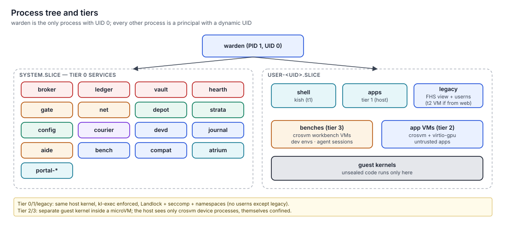

# Process tree and tiers

> Every process on a keylos machine descends from `warden`, belongs to exactly one principal, runs under its own dynamic UID in its own cgroup, and sits in one of five confinement tiers.
> This page shows the shape of the tree, how a process is created, and which tier each kind of workload uses.

**Status:** specified (v1.0). Owned by [warden](../../specs/warden/spec.md); tier-2 and tier-3 placement by [bench](../../specs/bench/spec.md); the legacy tier by [compat](../../specs/compat/spec.md).



## The tree

```
warden (PID 1 core, UID 0)
├── warden-supervisor (UID 0)          capwire server, routes, service lifecycle
├── warden-spawner (UID 0)             single-threaded clone3 executor
└── /keylos.slice
    ├── system.slice
    │   ├── journal.scope   ledger.scope   depot.scope   broker.scope   vault.scope   hearth.scope
    │   ├── strata.scope    devd.scope     net.scope     gate.scope     courier.scope config.scope
    │   ├── atrium.scope    bench.scope    compat.scope  aide.scope
    │   └── portals@alice.scope  pipewire@alice.scope …          per-human services
    └── user-1000.slice                                            (alice)
        ├── shell.slice/<session>.scope                            kish
        ├── apps.slice/<session>.scope                             tier-1 apps
        ├── agents.slice/<session>.scope                           host-side helpers of agent sessions
        ├── benches.slice/<session>.scope                          crosvm processes for t2/t3 VMs
        └── legacy.slice/<session>.scope                           tier-L processes
```

`cgroup.kill` on a session scope kills that session and everything it delegated to.

## Who is who

| Identity | Assigned by | Example |
|---|---|---|
| Principal | `warden` at spawn | `app:gen:fsv256:3f9a…@alice/s-01JB6Q…` |
| UID | `warden`, dynamic, per running principal instance | `0x00100A31` |
| cgroup | `warden` | `/keylos.slice/user-1000.slice/apps.slice/s-01JB6Q….scope` |
| On-disk owner of the human's files | `hearth` | UID 1000 (alice), presented to the principal through an idmapped mount |

Services learn their callers from warden, which creates every connection and names the peer in `ServiceHost.accept`; `Supervisor.identify(pidfd)` maps a process (pidfd → cgroup → principal), never a socket's peer. PIDs, executable paths and anything the caller says about itself are never used for identity.

## How a process is created

1. A caller (the shell, an app with a spawn right, `aide`, `warden` itself at boot) calls `Supervisor.spawn(SpawnSpec)`.
2. The supervisor checks the generation is launchable, verifies the grants with `broker`, and computes the effective tier.
3. For tier 2 or 3, it hands the request to `bench`, which starts a microVM. Otherwise it continues on the host.
4. It allocates a UID and a cgroup, obtains the generation mount from `depot`, builds the mount view, and wires routes to the services the manifest needs.
5. The spawner calls `clone3` with new mount, PID, IPC, UTS and cgroup namespaces (never a user namespace for native code), joins a pooled network namespace, and applies the baseline: credentials, no_new_privs, Landlock, seccomp.
6. `execveat` runs the entrypoint. `kl-exec` checks that the file lives on an allowed generation mount.
7. A `spawn` receipt is written.

Nothing is inherited implicitly: no environment, no fds, no working directory, no terminal, unless the spec lists them.

## Tiers

| Tier | Runs | Isolation boundary | Code allowed | Typical start cost |
|---|---|---|---|---|
| t0 | System services | Baseline + declared privileges | Sealed only | ≈ 5 ms |
| t1 | Apps, shells | Baseline (Landlock, seccomp, namespaces, dynamic UID) | Sealed only | 8 ms p50 |
| t2 | Untrusted apps (non-reproducible, internet-downloaded, user-chosen) | microVM (crosvm), GPU via native context | Anything inside the guest | 0.3–1 s |
| t3 | Workbenches: dev environments, agent sessions, unsealed code | microVM, snapshot and fork | Anything inside the guest | 100–300 ms from snapshot |
| legacy | Unmodified Linux binaries | Baseline + user namespace (nesting disabled) + FHS view + open broker | Sealed legacy images | ≈ 15 ms |

### How the tier is chosen

```
effective tier = max( manifest tier,
                      policy floor for this generation,
                      tier_floor of every capability token attached,
                      floor for the actor kind (agent → t3, legacy → legacy, app/shell → t1),
                      t2 if the generation is not reproducible and has no owner exception )
```

Policy can raise a tier, never lower it.

## What each tier can reach

| | t0 | t1 | t2 | t3 | legacy |
|---|---|---|---|---|---|
| Host kernel syscalls | baseline + declared extras | baseline | guest kernel only | guest kernel only | baseline |
| Host files | declared state + paths | its generation, its `.apps` data, granted fds | granted virtio-fs shares | granted shares, as copy-on-write overlays | image + granted views |
| Network | none, `gate`, or host (declared) | sockets from `gate` | `gate` via the VMM | `gate` via the VMM | `pasta` → `gate` |
| GPU | declared | render node if `needs.gpu` | native context | native context (optional) | per grant |
| Services | declared routes | routes allowed by policy | through the VM's proxy | through `aide`'s host API | routes allowed by policy |

## Limitations

- Tiers 0, 1 and legacy share the host kernel. A kernel bug reachable from the baseline syscalls breaks all three. Untrusted code belongs in t2 or t3.
- GPU drivers are reachable from tier-1 apps with `needs.gpu`. That is accepted for sealed apps and avoided for untrusted ones (t2 uses native context).

## Related

- [Confinement tiers](../06-security/confinement-tiers.md)
- [Namespaces](../06-security/namespaces.md)
- [Boot to desktop](boot-to-desktop.md)
- [warden spec](../../specs/warden/spec.md), [bench spec](../../specs/bench/spec.md), [compat spec](../../specs/compat/spec.md)
- [ADR-0024 Dynamic UIDs per principal](../11-decisions/adr-0024-dynamic-uids-per-principal.md), [ADR-0009 Unsealed code in workbenches](../11-decisions/adr-0009-unsealed-code-in-workbenches.md)
