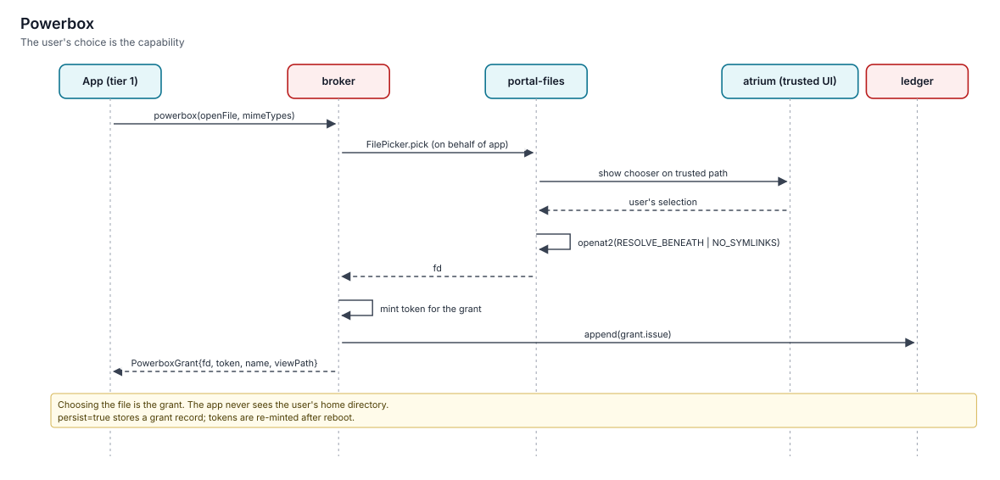

# Command signatures and typed pipes

> Every native command ships a machine-readable signature (`keylos.cmdsig/1`) declaring its arguments, flags, input and output types, effects and exit codes. The shell uses it to turn file arguments into file descriptors and to pick a pipe format before anything runs. Structured records flow between native commands; bytes flow everywhere else.

Status: **specified (v1.0)**. The contract is in [protocols §12](../../specs/protocols/spec.md); consumers are [kish](../../specs/kish/spec.md), [aide](../../specs/aide/spec.md) (agent tool definitions) and the [sdk](../../specs/sdk/spec.md).

## Why signatures

| Problem in a classic userland | What the signature fixes |
|---|---|
| `--help` prose is the only API | Completion, validation, help, agent tool schemas and the language server all read one JSON document |
| Programs open any path they like | The shell opens `file`/`dir` arguments with the declared access and passes fds; the program gets nothing else |
| Every tool re-parses text output | Producer and consumer agree on records statically; no in-band negotiation that could corrupt a byte stream |
| Exit codes mean different things per tool | The `exit` map says which non-zero codes are not errors (`grep`'s "no match") |

## Anatomy

```json
{
  "schema": "keylos.cmdsig/1",
  "name": "ls",
  "summary": "List directory entries",
  "args":  [{"name": "dirs", "type": "dir", "access": "read", "variadic": true, "default": "."}],
  "flags": [{"name": "all", "short": "a", "type": "bool", "summary": "Include hidden entries"}],
  "input":  {"type": "none"},
  "output": {"type": "records", "schema": {"name": "text", "size": "int", "kind": "text", "modified": "time"}},
  "effects": [],
  "net": [],
  "exit": {"0": "ok", "1": "partial", "2": "error"}
}
```

| Field | Meaning |
|---|---|
| `args`, `flags` | Typed parameters. Scalars: `bool`, `int`, `float`, `text`, `bytes`, `time`, `duration`, `size`. Filesystem: `path` (name only), `file`, `dir` (with `access`). Network: `host`, `url`. Composite: `list<T>`, `record{…}`, `enum[…]`, `secret-ref` |
| `input.type` / `output.type` | `none`, `bytes`, `records` (with a schema) or `any` |
| `effects` | Effect kinds the command may stage through `gate` (for example `git.push`); shown in help and in agent tool definitions |
| `net` | Hosts the command expects to reach. The shell turns `host`/`url` arguments into scoped network grants |
| `exit` | Meaning of exit codes. `ok`, `partial…` and `no-match…` descriptions are non-fatal |

Signatures live at `/.keylos/cmdsig/<name>.json` inside the command's generation. Because a generation is sealed, the signature is covered by the same fs-verity chain as the binary.

## From arguments to file descriptors



For each `file` or `dir` argument:

1. The shell resolves the path beneath a **held root** (home, cwd, earlier grants) with `openat2(RESOLVE_BENEATH | RESOLVE_NO_MAGICLINKS)`.
2. It opens the path with the declared `access`:

   | access | file | dir |
   |---|---|---|
   | `read` | `O_RDONLY` | `O_PATH` + read grant |
   | `write` | `O_WRONLY \| O_TRUNC` | `O_PATH` + write grant |
   | `create` | `O_CREAT \| O_EXCL` | create, then `O_PATH` |
   | `readwrite` | `O_RDWR` | `O_PATH` + read/write grant |

3. It passes the fd, replaces the argument text with `/dev/fd/<n>`, and sets `KEYLOS_ARGFD_<argname>=<n>`.
4. For directories it also attaches an attenuated token, so `warden` can add a Landlock rule allowing opens beneath that directory, and nothing else.

Native programs read `KEYLOS_ARGFD_*`. Legacy programs just open `/dev/fd/<n>`. Either way, the program cannot reach a file the human did not name.

## Pipe negotiation

The shell knows the signature of both ends of every pipe, so it decides the format before starting anything:

| Producer output → consumer input | Format on the pipe |
|---|---|
| `records` → `records` or `any` | CBOR sequence (RFC 8742); `KEYLOS_PIPE_OUT=cbor-seq` on the producer, `KEYLOS_PIPE_IN=cbor-seq` on the consumer |
| `records` → `bytes` | Text: the producer's formatter renders TSV (or `--format`) |
| `bytes` → `bytes` | Bytes |
| `bytes` → `records` | **Rejected before start**; insert an explicit `from json`/`from csv`/… stage |
| anything → `none` | Rejected |

- Schema compatibility is checked too. A consumer that requires a field the producer's schema lacks fails with `pipe-schema` before any process starts.
- In-process stages (shell builtins and functions) exchange values directly; the shell converts only at boundaries with external processes.

### Why static negotiation

A runtime handshake (magic bytes, a probe frame) would put protocol bytes into streams that legacy tools treat as data, and could be spoofed by a producer. Static negotiation uses information that is already sealed, and changes nothing on the wire for legacy programs. See [ADR-0036](../11-decisions/adr-0036-typed-pipes-via-cmdsig.md).

## Example

```kish
ls ./src | where { $it.size > 64KiB } | sort-by size --reverse | first 5
```

- `ls` (native, `records`) writes CBOR records.
- `where`, `sort-by` and `first` are in-process builtins working on values.
- The result renders as a table in the terminal.

```kish
ls ./src | ^wc -l
```

`wc` is a legacy command (bytes in), so `ls` renders TSV text and `wc` counts lines.

## Writing a signature

- The [sdk](../../specs/sdk/spec.md) generates cmdsig files from argument-parser definitions (for example `clap` derive structs) and validates them against the JSON Schema shipped by [protocols](../../specs/protocols/spec.md).
- Functions written in kish get an in-memory signature from their parameter list. Sealed kish scripts expose `fn main(…)` parameters as their signature.
- Agent tool definitions are derived from the same signatures by [aide](../../specs/aide/spec.md), so a command's effects and network needs are visible to the approval system before an agent runs it.

## Limitations

- Programs without a signature are untyped: output is bytes, and arguments are text, except arguments the human wrote as paths or globs. Those are opened **read-only** and passed as `/dev/fd/<n>`. Writing needs `run --write <path>`, because the shell cannot know which arguments a legacy tool writes to.
- Signatures describe intent; they do not constrain a program's behaviour. Confinement (Landlock, seccomp, `gate`) is what enforces it.
- Record schemas are flat maps of field name to type; nested schemas are expressed with `record{…}` types, and deep schema evolution is the producer's responsibility.

## Related

- [Shell](../09-experience/shell.md)
- [Portals and the powerbox](../09-experience/portals-and-powerbox.md)
- [kish spec](../../specs/kish/spec.md)
- [protocols spec §12](../../specs/protocols/spec.md)
- [ADR-0036 Typed pipes via cmdsig](../11-decisions/adr-0036-typed-pipes-via-cmdsig.md)
