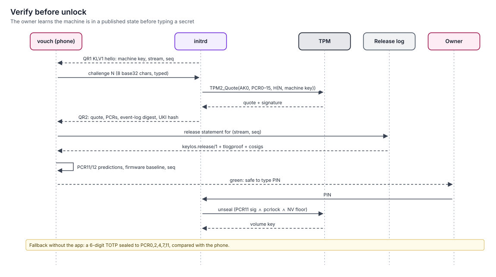

# Attestation and vouch

> Secure Boot stops untrusted code from booting, but it never tells you whether the machine in front of you is the one you left. keylos closes that gap with TPM quotes checked by a device you trust: your phone (vouch) or your organisation's verifier (fleet).
> Status: **specified (v1.0)**. Normative specs: [vouch](../../specs/vouch/spec.md), [fleet](../../specs/fleet/spec.md), [boot](../../specs/boot/spec.md).

## What attestation proves

A TPM2 quote is a signature by one of the machine's attestation keys over the current PCR values and a fresh nonce. keylos has two, both restricted ECC P-256 signing keys in the endorsement hierarchy: **AK0** (`0x81010003`) signs pre-unlock quotes for verify-before-unlock, and **AK** (`0x81010002`, usable only when PCR15 holds the enrolled volume identity) signs runtime quotes for vouch and fleet. If the PCR values match what a genuine keylos boot produces, the firmware, boot loader, UKI and kernel command line are the expected ones.

| PCR | Holds | Expected value comes from |
|---|---|---|
| 0–7 | Firmware, option ROMs, Secure Boot state | The machine's recorded baseline (updated on announced firmware updates) |
| 11 | UKI sections and boot phase | Release-log predictions for that UKI |
| 12 | Kernel command line and credentials | Release-log prediction (fixed per UKI) |
| 13 | System extensions | The "no extension" value |
| 14 | shim/MOK state | Only in shim fallback mode: the recorded baseline |
| 15 | Volume identity | Zero before unlock; a recorded constant after |

Attestation cannot see into a running kernel. An in-memory compromise after boot is invisible until the next boot measures the chain again. That is why keylos pairs attestation with [reboot heals](reboot-heals.md).

## Verify before unlock

The default on `desktop`, `laptop` and `compat`:

The protocol is shared by boot and vouch ([protocols §20.5](../../specs/protocols/spec.md#205-verify-before-unlock-vbu-protocol)):

1. The unlock screen shows a hello QR (`KLV1` + CBOR: machine key, stream, release `seq`, OS generation). You scan it with vouch.
2. The phone shows a challenge of **8 Crockford base32 characters** (40 bits, valid for 120 s). You type it on the machine, before the PIN.
3. The initrd computes `qualifyingData = SHA-256("keylos-vbu/1" ‖ challenge ‖ machine key)`, asks the TPM for an **AK0** quote over PCR 0–15, and shows it as a second QR code (TPMS_ATTEST, signature, PCR values, event-log digest, reset counters, UKI hash, stream and `seq`). Payloads over 1 000 bytes rotate through several QR frames.
4. The phone checks the AK0 signature and the challenge; that PCR11 equals the `enter-initrd` prediction and PCR12 the `pcr12` value of a `keylos.release/1` statement it holds with a log proof cosigned by enough witnesses; that PCR13 is the "no extension" value and PCR15 is still zero; that PCR 0, 2, 4, 7 match the accepted firmware baseline; and that `seq` is not lower than any seen before.
5. **Green** means type your PIN. **Red** means don't.

| Verdict | Meaning | What to do |
|---|---|---|
| Green | Genuine keylos release, unmodified boot chain, same TPM as paired | Unlock |
| Amber: firmware changed | PCR 0–7 changed after an announced firmware update | Accept the new baseline if you installed the update |
| Amber: release not verified | Phone offline for more than 30 days | Connect the phone and verify again |
| Red | Anything else | Do not type the PIN; see [suspected compromise](../10-operations/runbooks/suspected-compromise.md) |

**TOTP mode** is an alternative for owners who don't want to type a challenge. The machine shows a 6-digit code unsealed from the TPM, and the phone shows the expected code. It is weaker: it proves only that the sealed secret unsealed, and the phone cannot inspect the PCR values.

### Why this design

| Choice | Reason |
|---|---|
| QR from machine to phone, a short typed challenge from phone to machine | No Bluetooth, NFC or network stack in the initrd |
| A separate pre-unlock key (AK0) | AK is bound to PCR15, which is still zero before unlock |
| The phone generates the challenge | Replaying an old quote fails |
| The phone validates the EK chain and activates the AK credential at pairing | A software TPM cannot impersonate the machine |
| Expected values come from the transparency log | The phone does not trust the machine's word about which release it runs |

## Witnessing the receipt log

Every machine keeps a hash-chained receipt [ledger](../04-contracts/receipts.md). Each checkpoint note carries the value of the TPM monotonic counter `0x01300100`. Witnesses fetch and cosign through `LedgerWitness` (ledger facet `witness`). A paired phone, or the fleet server, acts as a **witness**:

- It cosigns a new checkpoint only after verifying a consistency proof from the last one it cosigned.
- It alerts on rollback: a smaller tree, a different root at the same size, or a counter that went backwards.
- It keeps both conflicting signed checkpoints as evidence.

This turns "someone restored an old disk image to hide what happened" into a detectable event, even when the attacker had the disk offline.

## Fleet attestation

On `server` and `appliance` profiles, and on enrolled laptops, the [fleet](../10-operations/fleet.md) server requests quotes on a schedule (default every 60 minutes). It verifies them against the release log and the recorded firmware baseline, and sets the device's compliance state. The server stores only checkpoint sizes and roots, never receipt contents.

| | vouch | fleet |
|---|---|---|
| Who verifies | The owner's phone | The organisation's server |
| When | Before each unlock (interactive) | Periodically while running |
| Proves | The boot chain the owner is about to trust | The boot chain the device last booted |
| Also witnesses | Ledger checkpoints, optionally the release log | Ledger checkpoints |

## Remote approvals (vouch)

vouch can also approve or deny **non-presence** T2/T3 prompts while you are away from the machine. For example, an agent session running unattended asks to open a pull request. The phone shows the rendered effect and argument provenance, and signs a mandate with a biometric-gated hardware key.

Phone approvals arrive through `VouchLink.routeApproval` and produce mandates with `channel: "phone"`. A policy permit must list the phone channel (`@channels("local,phone")`) for the effect kind. Presence-class actions are **never** approvable from the phone: config apply, seal, policy change, payment, persistent grants, and anything whose policy says `presence`. Those need your FIDO2 key at the machine. The set of effect kinds the phone may approve is an explicit allowlist in your configuration.

## Limitations

- A "cuckoo" attack, where a lookalike machine relays challenges to your stolen real machine, cannot be fully prevented. The optional unlock picture sealed to the TPM makes simple lookalikes fail.
- Attestation proves boot state, not runtime state.
- Firmware updates without vendor measurement manifests require you to accept a new PCR 0–7 baseline once.
- Discrete TPMs remain exposed to bus attacks. The PIN is the remaining defence.

## Related

- [Boot chain](boot-chain.md)
- [Reboot heals](reboot-heals.md)
- [vouch spec](../../specs/vouch/spec.md)
- [fleet spec](../../specs/fleet/spec.md)
- [Install and enrolment](../10-operations/install-and-enrolment.md)
- [ADR-0015: Verify before unlock](../11-decisions/adr-0015-verify-before-unlock.md)
