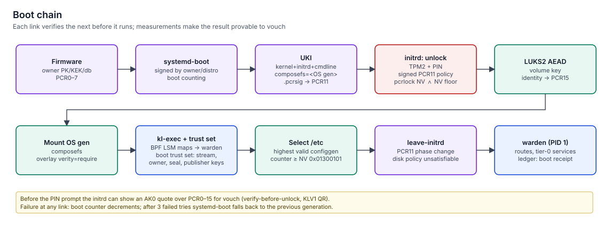

# Boot chain

> How keylos turns powered-on hardware into a verified running system, and why the disk unlocks only for a genuine, current release on the expected firmware, with the owner's PIN, on the enrolled disk.
> It reuses systemd-boot and systemd-stub, and replaces the rest with a small Rust initrd and a carefully composed TPM policy.

**Status:** specified (v1.0). Owned by [boot](../../specs/boot/spec.md); maintained over time by [courier](../../specs/courier/spec.md).

## Secure Boot: owner keys by default

| Mode | `db` contains | When used |
|---|---|---|
| Owner (default) | The keylos release-stream certificate, the owner's certificate, hashes of required option ROMs. No Microsoft third-party CA | Hardware that allows custom keys (most laptops and desktops) |
| Shim (fallback) | Firmware defaults; shim + MOK trusts the keylos key | Hardware that cannot drop the Microsoft CA, or the owner prefers dual boot |

In owner mode, no Microsoft-signed shim or GRUB can boot. That removes the whole class of downgrade attacks that reuse old signed boot loaders. The owner's Key Exchange Key and db signer live in the TPM (`0x81000101`, `0x81000102`) under a policy that requires one owner's seal gate, which only a fresh FIDO2 touch through hearth unlocks, so changes to `db` and `dbx` need a physical touch.

## The UKI

A UKI (Unified Kernel Image) is one signed PE file that contains the kernel, the initrd, the command line, os-release, the public key for PCR policy signatures, and the signed PCR policies. The command line pins:
- the OS generation digest (`composefs=<digest>`);
- the release stream and sequence number;
- hardening options: `lockdown=integrity`, LSM order `landlock,lockdown,yama,ipe,bpf`, the `kl-exec` map fd numbers, IOMMU, init-on-alloc/free;
- sysctls such as `vm.memfd_noexec=2`.

It cannot be edited at boot.

## PCRs

| PCR | Holds | Role in keylos |
|---|---|---|
| 0, 2, 4, 7 (and 14 with shim) | Firmware, option ROMs, boot loader and UKI image, Secure Boot state | Machine-specific pcrlock policy in TPM NV |
| 11 | UKI sections and boot phases (`enter-initrd`, `leave-initrd`, `sysinit`, `ready`, `enter-recovery`) | Signed by the release stream |
| 12 | Kernel command line and credentials | Predicted in the release statement (`pcr12`) |
| 13 | System extensions | Always the "no extension" value; keylos uses none |
| 15 | Volume identity (LUKS volume key hash) | Binds later secrets (keystore, homes, ledger key, counter auth values) to *this* disk |

**PCR11 phases**, each extended exactly once per boot, in this order ([protocols §19.6](../../specs/protocols/spec.md#196-tpm-objects)):

| Phase | Extended by | When |
|---|---|---|
| `enter-initrd` | `kl-initrd` (first step of the initrd, protocols §19.6) | Before the initrd unlocks anything. The disk-unseal policy is bound to this phase |
| `leave-initrd` | boot | After unlock, PCR15, trust-set write and kl-exec load; immediately before `switch_root` |
| `sysinit` | warden | After mounting `/var`, `/home`, `/store`, `/keystore` and taking over the kl-exec maps |
| `ready` | warden | Immediately before the first tier-0 service starts. Service keys, NV authValues and hearth's hierarchy auth are sealed to this phase |
| `enter-recovery` | boot | Instead of `leave-initrd`, in the recovery profile; nothing sealed to `ready` is available afterwards |

No component extends PCR11 after `ready`.

**Reading NV without owner auth.** Every keylos NV index carries a public `PolicyCommandCode(NV_Read)` branch, so `boot` reads counters, the floor and the owner-registry head in the initrd without any hierarchy authorization. Writes stay controlled per index. The one exception is `vault-epoch`, which is secret. The owner-hierarchy auth itself is a random value sealed for `hearth` only (PCR11 `ready` ∧ PCR15), and the lockout auth derives from the recovery key.

The full TPM registry (NV indices and persistent handles) is in [Registries](../04-contracts/registries.md#tpm-objects).

## The unlock policy

The disk's keyslot secret is sealed in the TPM under a policy that requires, in order:

1. **PCR11 matches a release-signed prediction**, and the **release sequence is not below the TPM floor** (both inside one signed policy).
2. **PCR 0, 2, 4, 7 match the machine's pcrlock policy** stored in TPM NV `0x01300103` (`PolicyAuthorizeNV`), maintained by `courier` across updates.
3. **The owner's PIN.** The TPM's dictionary-attack lockout limits guessing.

| Property | How |
|---|---|
| Updates don't break unlocking | PCR11 is authorised by signature, not by literal value; `courier` writes the new pcrlock branches before rebooting |
| Old vulnerable releases can't unlock | The os-floor index `0x01300102` holds the minimum bootable release `seq`; the floor check is part of the signed policy, so raising the floor invalidates old releases without re-sealing |
| Bus sniffing gets nothing useful | Salted, encrypted TPM sessions bound to the SRK pinned at enrolment; the PIN is also required |
| The secret is unavailable after the initrd | PCR11 `leave-initrd` is extended before `switch_root` |

## Volume identity

After unlocking, `kl-initrd` derives an identity from the volume key and the LUKS UUID and compares it with the enrolled value. A mismatch halts the boot. The identity is extended into PCR15, and secrets released later (the vault keystore, home directories, the ledger signing key) are bound to that PCR15 value. This closes the partition-swap attack, where a TPM releases a key that ends up serving an attacker-supplied volume.

Additionally, the initrd never tries other keyslots (no empty passphrase, no keyfile search), and the root filesystem is the cmdline-pinned composefs image. An attacker's files on a swapped volume are never executed.

## The release floor

The floor lives in TPM NV `0x01300102`, an ordinary 8-byte index holding the minimum bootable release `seq`. Reading it is public. Writing it needs a policy that the release-stream key authorized (`PolicyAuthorize`, policy reference `keylos/floor-write/1`), and each release's approved policy binds **one exact target** ([ADR-0060](../11-decisions/adr-0060-exact-target-floor-authorization.md), protocols §19.6):

| Element of the approved policy | What it enforces |
|---|---|
| PCR11 at `ready` of that release's UKI | Only the booted, measured release can write, so one boot has exactly one possible target |
| `PolicyNV`: current floor ≤ F | A write can only keep or raise the floor |
| `PolicyCpHash` of the complete `NV_Write` of F at offset 0 | Wrong index, offset or value fails, even for a caller bypassing courier with raw TPM commands |

F is the release statement's declared `floor`. courier writes exactly F after the release is assessed healthy; it never writes an intermediate value. If an owner pin is below F, courier keeps the current floor. A lost acknowledgment is handled by writing F again. The installer UKI and the cloud `seed` profile carry an initialisation policy (`PolicyNvWritten(NO)`) that works only on a never-written index. A missing or unreadable floor after provisioning, for example after a TPM clear, is a recovery and re-enrolment condition: the new baseline comes from the signed statement of the release being re-enrolled, and the TPM's history is gone.

## Code integrity from the first instruction

The initrd loads the `kl-exec` BPF LSM before running anything but itself, registers the OS and bootstrap generations, writes the **boot trust set** (`/run/keylos/boot/trust.json`: release-stream keys from the UKI, owner-presence keys from the owner registry anchored in NV `0x01300105`, owner-seal and publisher keys from the verified config generation) and hands the map fds to warden. See [Exec integrity and sealing](exec-integrity-and-sealing.md).

The config generation is chosen here too: the highest-counter owner-signed `keylos.configgen/1` statement with counter ≥ the TPM config counter (`0x01300101`). If none verifies, the safe config shipped in the OS generation boots instead.

## Recovery

A 256-bit recovery key, shown once at enrolment, unlocks the disk through a separate LUKS keyslot with strong Argon2id parameters (m = 1 GiB, t = 4, p = 4). Its text form is 64 hex digits in 8 groups of 8, each followed by a 2-digit CRC-8, so a mistyped group is pinpointed ([protocols §20.21](../../specs/protocols/spec.md#2021-recovery-key)); it can also be split into Shamir trustee shares. The recovery profile extends PCR11 with `enter-recovery`, so no TPM-sealed secret becomes available. It starts the recovery generation, which can re-enrol the TPM, stage a release from removable media, or restore backups. The recovery auth object (`0x81000105`, derived from the recovery key) is the second branch of the pcrlock-policy write policy, so recovery can rewrite the PCR0–7 policy after a firmware change.

**Activation failure is never an automatic fallback.** If a newly applied config generation fails to activate, config records an `activation-failed` note; the next boot still selects the highest valid counter, and the recovery entry offers a revert that an owner signs with presence ([protocols §15](../../specs/protocols/spec.md#15-config-generation-statement-keylosconfiggen1)). An attacker therefore can't force an older configuration by breaking activation.

## Limitations

- The pcrlock part still depends on firmware event logs that can be predicted. Unpredictable PCRs are dropped from the policy (recorded and shown in `courier status`) rather than failing every boot.
- Firmware updates cannot usually be predicted. For exactly one boot, PCR0 and PCR2 are left out of the policy, with presence approval and a recommendation to verify with the phone.
- Machines without a TPM run the degraded profile: passphrase unlock, no measured boot guarantees.
- Hibernation is unsupported: kernel lockdown refuses it. Suspend-to-RAM works, and swap is keyed per boot.

## Related

- [Boot to desktop](../02-architecture/boot-to-desktop.md)
- [Updates and rollback](../10-operations/updates-and-rollback.md)
- [Attestation and vouch](attestation-and-vouch.md)
- [boot spec](../../specs/boot/spec.md), [courier spec](../../specs/courier/spec.md)
- [ADR-0013 Owner Secure Boot keys](../11-decisions/adr-0013-owner-secure-boot-keys.md), [ADR-0014 TPM + PIN with a signed PCR policy](../11-decisions/adr-0014-tpm-pin-signed-pcr-policy.md)
