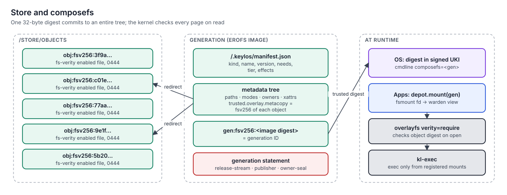

# Exec integrity and sealing

> On the host, keylos executes only code whose bytes are committed to by a signed generation. Unsealed code (your builds, downloads, anything an agent writes) runs in a workbench microVM with its own kernel.
> When you want your own code on the host, you seal it with a physical touch.

**Status:** specified (v1.0). Enforcement by [boot](../../specs/boot/spec.md) (the `kl-exec` program) and [warden](../../specs/warden/spec.md) (its maps); sealing by [depot](../../specs/depot/spec.md) and [forge](../../specs/forge/spec.md); workbenches by [bench](../../specs/bench/spec.md).

## The rule

| Where | What may execute |
|---|---|
| Host (tiers 0, 1, legacy) | Files on a composefs mount of an **allowed generation**: the booted OS, release-stream or publisher-signed apps, owner-sealed generations |
| Workbench and tier-2 VMs | Anything. The guest kernel is the boundary, and the VM sees only what was granted |

## How the host enforces it



composefs gives every generation a single digest that commits to all its file contents and metadata. Mounted with `verity=require`, the kernel checks each file's fs-verity digest against the image on every open, and each page on read.

`kl-exec` is a BPF LSM program that `kl-initrd` loads before any other code runs ([protocols §9.3](../../specs/protocols/spec.md#93-code-integrity-host)). It decides on:

| Hook | Allowed when |
|---|---|
| `bprm_check_security` (`execve`) | The file's superblock `s_dev` is in `kl_exec_allowed_sb`, or the initrd phase is active and the file is on the initramfs |
| `bprm_creds_for_exec` (check-only `execveat(…, AT_EXECVE_CHECK)` from interpreters) | Same rule. A check-only exec returns before `bprm_check_security`, so this hook is what refuses an interpreter's check of an unregistered script |
| `mmap_file` with `PROT_EXEC` | File-backed: same as exec. Anonymous: only for cgroups in `kl_exec_jit_cgroups` |
| `file_mprotect` adding `PROT_EXEC` | File-backed: same as exec. Anonymous or private-writable: JIT cgroups only |
| `kernel_read_file` (firmware, modules, policy, X.509) | The file is on an allowed generation mount, or the initramfs during the initrd phase. kexec reads are always denied |
| `kernel_load_data` (`init_module`, firmware blobs) | Never; modules load only through `finit_module` from verified files |
| `bpf` program load or detach | Only the `warden` core (thread-group ID recorded in `kl_exec_policy.warden_tgid` at hand-over) and `boot` in the initrd; a debugger with a kernel-scope debug pair may load tracing program types only (kprobe, tracepoint, raw_tracepoint, perf_event) |
| `ptrace_access_check` | Only from a tracer cgroup with an unexpired `kl_debug_pairs` entry covering the tracee ([Debugging](../06-security/debugging.md)). No task is exempt, not even the warden core; the hook also guards `/proc/<pid>/{ns,maps,mem,…}`, `pidfd_getfd` and namespace access through pidfds |
| `perf_event_open` | Only for a task with a debug pair (the hook sees only the event type) |
| `perf_event_alloc` | The event's target: task or cgroup events inside the pair's target for scope `process` (no CPU-wide events), system-wide for scope `kernel` |

### The maps

boot hands the map fds to warden as fds 3–7 (`keylos.execmapfds=3,4,5,6,7`) and the ten hook link fds as fds 9–18 (`keylos.execlinkfds=9,…,18`). The links keep the program attached; warden holds them for its whole life and nothing is pinned in bpffs. The program reads kernel structures at offsets computed from the kernel's BTF at load, and the event fields, hook IDs (1–10) and phase values (INITRD 0, SYSTEM 1) are fixed in protocols §9.3. `s_dev` is always the kernel's own `dev_t` encoding (`major << 20 | minor`), not `st_dev`:

| Map | Content | Writer |
|---|---|---|
| `kl_exec_allowed_sb` | `s_dev` → generation index, 65 536 entries | warden core only |
| `kl_exec_jit_cgroups` | cgroup ID → 1, 4 096 entries | warden core only |
| `kl_exec_policy` | `{enforce, audit_allow, phase, warden_tgid}` | boot, then frozen after `warden_tgid` is written at hand-over |
| `kl_exec_events` | ring buffer of denials | read by warden core |
| `kl_debug_pairs` | tracer cgroup → `{target cgroup, expiry, scope}`, 256 entries | warden core only (`DebugAttach`, and the legacy open-broker read-only pairing) |

### Other kernel code paths

- **Modules** load only from the OS generation or from a `kmod` generation, and every module carries the release stream's module signature (`module.sig_enforce=1`). warden registers a `kmod` mount only if its `kmod.kernel` matches the running kernel. Owner-sealed modules don't exist ([ADR-0057](../11-decisions/adr-0057-oot-modules-project-signed-only.md)).
- **Service BPF programs** (strata provenance, net and gate helpers) are loaded by warden only from the OS generation (`/usr/lib/keylos/bpf/<service>/*.o`, listed in `services.json`), and their map fds reach the service as `KEYLOS_BPF_FDS`. Services never call `bpf()`.
- **Core dumps.** The kernel's coredump pipe helper starts in the root cgroup. It's an OS-generation binary that installs its own seccomp filter and moves itself out within 1 s, and `journal` verifies the move; the `bpf` rule depends on the thread-group ID, not the cgroup, so this exception grants nothing. The helper reads only `/proc/<pid>/{cgroup,status}` and takes file mappings from the core itself, because `/proc/<pid>/maps` is ptrace-guarded.
- **Supervising without ptrace.** warden controls processes through pidfds (signals, exit, `PIDFD_GET_INFO`) and namespace fds each child sends at spawn; it never opens another task's `/proc/<pid>/ns/*` ([ADR-0069](../11-decisions/adr-0069-s3-execution-core-contract-fixes.md)).
- **Known limitation.** Adding `PROT_EXEC` with `mprotect` to a composefs file mapping is refused outside JIT cgroups, because the hook sees the backing file. `execve` and `mmap(PROT_EXEC)` are unaffected.

### Registering a generation

Before a mount's superblock enters `kl_exec_allowed_sb`, the registrant (boot for the OS and bootstrap generations, warden for everything else, including mounts it makes for bench and compat):
1. gets the tree from `depot.mount`, or mounts it itself with `verity=require` from a digest-checked image, as boot does;
2. verifies the generation statement (`keylos.genstmt/1`) against the **boot trust set** (`/run/keylos/boot/trust.json`): release-stream keys from the UKI, publisher keys and owner-seal keys from the verified config generation, owner-presence keys from the owner registry anchored in TPM NV;
3. checks the generation isn't `unlaunchable` in the current revocation list;
4. reads the superblock device with `statx` on the tree fd and converts it to the kernel `dev_t`.

This is sound because the overlay was mounted with `verity=require` from an image whose digest was checked, overlay superblocks aren't shared between mounts of different images, and only warden can update the map. Writable mounts are also always `noexec`.

### Why not IPE or IMA alone

| Option | Problem |
|---|---|
| IMA appraisal | Per-file signature xattrs get lost by copies and overlays; operationally painful |
| IPE with fs-verity builtin signatures | One kernel-verifiable signature per store object (millions); the kernel can't verify Ed25519, so every signing root would need a second P-256 key; builtin signatures are discouraged upstream; and IPE can't express "reached through a composefs mount of generation X" |
| IPE with an "`.ipe` keyring" | IPE has no keyring of its own |
| kl-exec keyed by overlay superblock | One check per mount; the mount itself was verified in userspace against a signed digest |

keylos therefore uses **no fs-verity builtin signatures and no `.fs-verity` keyring policy**. Generation statements are DSSE envelopes verified in userspace.

### IPE as a second layer

IPE runs a policy signed by `kernel-policy/<stream>`:

```
policy_name=keylos policy_version=1.0.0
DEFAULT action=ALLOW
op=KEXEC_IMAGE action=DENY
op=KEXEC_INITRAMFS action=DENY
op=EXECUTE boot_verified=TRUE action=ALLOW
op=KERNEL_READ boot_verified=TRUE action=ALLOW
```

Modules are signature-enforced (`module.sig_enforce=1`) and ship only inside the OS generation or release-signed `kmod` generations. Unprivileged BPF is off, `vm.memfd_noexec=2`, and only boot and warden have signed BPF loaders.

## Scripts and interpreters

Interpreters bypass exec checks unless they cooperate. keylos ships every interpreter (sh, kish, Python, Perl, Lua, Ruby, Node) patched to call `execveat(fd, AT_EXECVE_CHECK)` before running a script file, so a script on a non-allowed mount is refused exactly like a binary.

| Securebit | Applied to | Effect |
|---|---|---|
| `SECBIT_EXEC_RESTRICT_FILE` | Every host principal | Interpreters refuse script files that fail the exec check |
| `SECBIT_EXEC_DENY_INTERACTIVE` | Every host principal **except** the process tree spawned through `TrustedSpawn.spawnTerminal` (the human's trusted terminal in atrium) | Interpreters refuse code from stdin, `-c` and REPLs |

The **trusted-terminal tree** is the process spawned through `TrustedSpawn.spawnTerminal` plus every job that `kish` running in it starts (foreground or background, including REPLs). A process spawned by some *other* program in that tree, such as an editor's helper, gets both securebits: warden decides by the spawning principal and the `SpawnSpec` origin, not by ancestry alone.

A human can type commands into their trusted terminal, and that shell can pipe text into Python. A service, an app or an agent's host helper cannot feed code to a host interpreter.

## JIT

Browsers, JVMs and JavaScript engines need writable-then-executable memory. Their generations declare `needs.jit: true`, which:
- is shown at install time;
- adds the process's cgroup to the JIT set;
- skips `PR_SET_MDWE` for that process.

Every JIT generation is a known runtime-integrity exception, contained by its tier. The browser runs in tier 1 at minimum, and tier 2 is offered.

## Workbenches: where unsealed code runs

| Activity | Where it runs |
|---|---|
| `cargo build`, `npm install`, `pip install`, test suites | Project workbench (t3) |
| Running a binary downloaded from the internet | t2 VM |
| Everything an AI agent does | Agent session workbench (t3), forked from the project workbench |
| A one-off script you just wrote | Workbench, or seal it |

A workbench starts from a snapshot in 100–300 ms. It receives only the project directory (as a share) and network through `gate`, and it never sees host secrets.

## Sealing: promoting your code to the host

```
$ seal ./target/release/mytool
  rebuild hermetically in a workbench  →  same output digest?  →  store as a generation
  touch your security key              →  owner-seal signature (TPM key usable only with presence)
  mytool is now launchable on the host
```

| Property | Value |
|---|---|
| Who signs | The owner-seal key `owner-seal/<i>`: a TPM-resident P-256 key (`0x81000140+i`) whose only policy is `PolicySecret` on the owner's NV seal gate (`0x01300140+i`) |
| How a touch unlocks it | hearth's `HearthSeal.openWindow` takes one presence-signed `keylos.seal-window/1` and one FIDO2 `hmac-secret` assertion with two salts: the current gate auth and the next one. At window close hearth rotates the gate auth and zeroizes both, so a captured value is useless afterwards |
| Sealing window | At most 600 s, one project directory, the listed derivations |
| What is recorded | A `keylos.seal/1` statement (generation, derivation, source tree, window ID and digest), a `keylos.genstmt/1` signed by the owner-seal key, and `seal.window` and `gen.seal` receipts |
| How the host learns the key | The owner-seal public keys are in the signed config generation (`/etc/keylos/owner-seal/<i>.spki`) and enter the boot trust set at every boot |

## Limitations

- JIT generations are holes in W^X by design.
- An owner tricked into sealing malicious code makes it trusted. The presence prompt shows the source, the diff since the last seal, and the provenance of each input, to make this a deliberate act.
- Interpreter enforcement depends on keylos carrying the `AT_EXECVE_CHECK` patches until the upstream projects adopt them.

## Related

- [Reboot heals](reboot-heals.md)
- [Confinement tiers](../06-security/confinement-tiers.md)
- [Boot chain](boot-chain.md)
- [boot spec](../../specs/boot/spec.md), [warden spec](../../specs/warden/spec.md), [bench spec](../../specs/bench/spec.md), [depot spec](../../specs/depot/spec.md)
- [ADR-0008 The host executes only sealed code](../11-decisions/adr-0008-host-executes-only-sealed-code.md), [ADR-0009 Unsealed code runs in workbenches](../11-decisions/adr-0009-unsealed-code-in-workbenches.md), [ADR-0012 Sealing windows](../11-decisions/adr-0012-sealing-windows.md)
