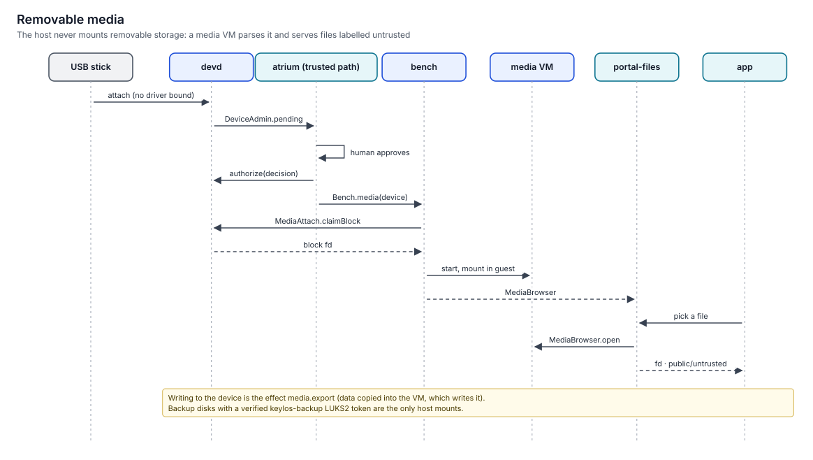

# Devices and media

> Hardware is authority. A newly plugged device does nothing until a human approves it on the trusted path. Keyboard-like devices need confirmation from an input device that is already trusted. DMA-capable devices need an active IOMMU. Removable storage is never parsed by host filesystem drivers: a disposable media VM mounts it, and its files arrive labelled untrusted.
> Status: **specified (v1.0)**. Normative: [protocols §9.5](../../specs/protocols/spec.md#95-devices-removable-media-and-dma), [devd](../../specs/devd/spec.md), [bench](../../specs/bench/spec.md).

## USB authorization

### Before devd: the initrd authorizer

The kernel command line carries `usbcore.authorized_default=2`, so only internal devices are authorized while the system boots. The initrd needs a keyboard for the PIN and a FIDO2 key for presence, so it runs a small authorizer before unlocking (protocols §9.5):

- it authorizes external hubs, and devices whose interfaces are **all** HID and that are listed in `/var/lib/keylos/devd/preauthorized.json` (`keylos.preauth/1`, written by the installer and updated by devd when a human remembers a device);
- it authorizes nothing else: no storage, no network adapters, no composite devices with non-HID interfaces;
- after `switch_root`, `devd` re-evaluates every device, sets `authorized_default=0` on every host controller, and deauthorizes devices that are neither pre-authorized nor remembered.

Injected keystrokes during that window can reach only the PIN prompt (residual risk R15 in the [distribution spec](../../specs/keylos/spec.md)).

### After devd

| Step | What happens |
|---|---|
| Attach | `devd` has set `authorized_default=0`; the kernel enumerates the device but binds no driver |
| Prompt | atrium shows the device on the trusted path: classes, port, descriptor strings rendered as untrusted text |
| Decide | The human approves once, or approves and remembers. atrium asks the broker with `requestFor` (atrium itself as subject); the decision comes back as a mandate re-signed by `service/broker`, or signed by owner presence |
| Authorize | `DeviceAdmin.authorize(device, persist, decisionEnvelope)`: `devd` verifies the mandate (broker key looked up with `Ledger.serviceKey`, or the owner registry for presence), then sets the kernel's authorized flag; `device.authorize` receipt |
| Remember | Identity stored: vendor, product, serial, port |

**BadUSB defence.** A device exposing a keyboard-like HID interface (`hidSafety: "keyboard-like"`) can be approved only with an input device that is already authorized. Its own keystrokes are discarded until then, so a fake keyboard can't approve itself.

**Auto-authorization.** `devices.autoAuthorize` may list classes such as `audio` or `fido`. `hid`, `net` and `mass-storage` are never auto-authorized by default. Input devices present during installation are pre-authorized.

## DMA: Thunderbolt, USB4 and external PCIe

- The IOMMU is required on every profile except `degraded` (kernel cmdline `iommu=force` with `intel_iommu=on` or `amd_iommu=force_isolation`).
- Thunderbolt/USB4 security level is `secure` or `user`. Domains are authorized by `devd` only after trusted-path approval, and never without an active IOMMU.
- Pre-boot DMA protection depends on firmware; the boot report records whether firmware declared it.

## Removable storage

1. The human authorizes a mass-storage, SD, optical or MTP device.
2. `Bench.media(device)` starts a **media VM** (`purpose: media`, image `io.keylos.bench.media`). `devd` hands the block device over with `MediaAttach.claimBlock`; the host never mounts it.
3. The VM mounts the filesystem and serves `MediaBrowser` (`list`, `open`, `export`, `eject`).
4. `portal-files` shows a location **USB: &lt;label&gt;**. Bytes read through `MediaBrowser.open` are labelled `public/untrusted`, so labels and the Rule of Two apply to them.
5. Writing to the device is the effect `media.export`. Data is copied into the VM, which writes it. Receipts `media.attach`, `media.export`.
6. `eject` unmounts in the guest, releases the device and stops the VM.

**Backup disks** are the one exception. A disk whose LUKS2 header carries the `keylos-backup` token, verified against the machine's backup key, is unlocked and mounted on the host by `strata`, for backups only.

## Other devices

| Device | Rule |
|---|---|
| Fingerprint reader | Screen-lock unlock only; never presence, never disk unlock |
| FIDO2 / smart cards | Per-session grants (hidraw or pcsc) for the browser or tools that need them |
| GPUs for VMs | VFIO passthrough only for devices listed in `devices.passthrough` (`MediaAttach.claimVfio`); the host driver is unbound for the VM's lifetime |
| Cameras, microphones | Through portals with indicators ([Portals and the powerbox](../09-experience/portals-and-powerbox.md)) |
| Scanners | `portal-scan`, with SANE backends in a compat island; each scan confirmed on the trusted path |
| Realtime audio | `needs.realtime` gives `RLIMIT_RTPRIO = 20` and `RLIMIT_RTTIME = 200 ms`; no realtime broker daemon |

## Out-of-tree kernel modules

Kernel modules load only from the OS generation or from `kmod` generations built by `forge` and signed by the release stream. The NVIDIA open modules are shipped this way. Owner-sealed modules don't exist ([ADR-0057](../11-decisions/adr-0057-oot-modules-project-signed-only.md)).

## Limitations

- Docks with many child devices produce a grouped approval; devd groups by port.
- Machines without an IOMMU cannot use Thunderbolt devices at all.
- Copying to a stick takes a VM start and an export step.

## Related

- [Profiles and hardware](../01-overview/profiles-and-hardware.md)
- [Trusted path](trusted-path.md)
- [Labels and the Rule of Two](labels-and-rule-of-two.md)
- [devd component](../03-components/devd.md)
- [ADR-0052: USB authorization and the media VM](../11-decisions/adr-0052-usb-authorization-and-media-bench.md)
