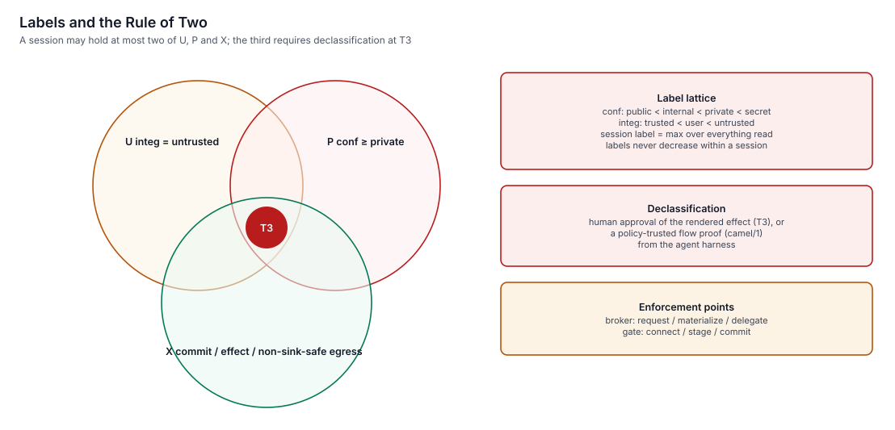

# Network egress

> Every byte that leaves a keylos machine on behalf of a principal goes through one component, `gate`. Principals have no network stack of their own. They get connected sockets for the hosts they were granted, and DNS only for those names.
> This page explains the egress paths, when TLS is intercepted, and how the Rule of Two and covert-channel limits apply at the network edge.

**Status:** specified (v1.0). Components: [gate](../../specs/gate/spec.md), [net](../../specs/net/spec.md).

## The shape

| Who | Network namespace | How it reaches the internet |
|---|---|---|
| `net` (links, DHCP, DNS upstreams, NTS, WireGuard) | Host | Directly, firewalled by UID |
| `gate-net` (gate's socket owner) | Host | Directly, firewalled by UID |
| Tier-0 services and tier-1 apps | Private, `lo` only | Sockets handed over by `gate.connect`, usually via `broker.materialize` |
| Tier-L legacy processes | Private, `lo` only, with nftables redirect | `gate-shim` inside the namespace → per-principal `ShimEndpoint` (gate facet `shim`) |
| Tier-2 apps and tier-3 workbenches (agents) | Guest kernel with one virtio-net device | The NIC is terminated on the host by `bench-net`, a userspace network stack; each guest flow becomes one `ShimEndpoint.connect` on gate. DNS answers come from `ShimEndpoint.resolve` for granted names only. There is no tap device and no vsock path to gate |

No principal other than `net` and `gate-net` ever has a socket in the host namespace. The host firewall rejects inet traffic from every other UID, as a second layer.


## What a network grant is

A network grant is a Biscuit token fact:

```
net("api.github.com", 443, "https", "GET")
```

The grant names a host, a port, a protocol (`tcp`, `udp`, `https`) and optionally HTTP methods. `"*"` means "no HTTP-level restriction". On every connection, gate checks:

1. the token signature, revocation and expiry (against NTS-authenticated time);
2. the token's Datalog checks against the request: host, port, method, session label;
3. the Rule of Two (below);
4. that the resolved address is not a LAN, loopback or link-local address, unless that literal was granted, which blocks DNS rebinding.

## DNS

Principals never talk to a DNS server. gate resolves names through `net`'s validating resolver. That resolver uses DoH/DoT upstreams with DNSSEC validation by default.

The DNS stub that `gate-shim` provides inside legacy namespaces, and that `bench-net` provides to VMs (both backed by `ShimEndpoint.resolve`), answers **only names that appear in the principal's grants**. Everything else is `REFUSED`. This closes the most common exfiltration channel for injected agents: encoding data into subdomain lookups of an attacker's zone.

## TLS: relayed by default, intercepted only when necessary

| Grant | What gate does | Can gate see requests? |
|---|---|---|
| `https`, no method filter, no credential injection | Checks that the TLS ClientHello SNI matches the granted host, then relays bytes untouched | No |
| `https` with a method filter, or with a credential-injection rule for the host | Terminates TLS with a **per-session CA**, enforces method, path and size per request, injects credentials, then opens its own TLS to the host | Yes |
| `tcp` / `udp` | Relays bytes (UDP via SOCKS5 UDP associate) | No |

The interception CA:
- is generated per session and lives only in memory;
- carries `nameConstraints` limited to the session's intercepted hosts;
- expires with the token (at most 24 h);
- is installed only into that session's view or guest trust store.

Interception is disclosed in receipts, `gate status`, and the process's confinement report (`tlsInterception`, with the intercepted hosts). In VMs the session CA reaches the guest trust store through a read-only `keylos-ca` share filled from `ShimEndpoint.caBundle`. Apps that pin certificates fail on intercepted hosts. The user can grant such hosts without method filtering, which is shown at consent time as "all traffic to this host".

## Credentials never enter the principal

Agents and tier-2/3 workloads never receive API keys, tokens or SSH private keys. gate adds them on the wire:

| Kind | Mechanism |
|---|---|
| Bearer/API headers | Header template filled from a `vault.inject` handle |
| Basic auth, query keys | Same, different placement |
| AWS SigV4 | gate signs the request |
| OAuth for remote MCP servers | gate holds the refresh token; exchanges it for short-lived, audience-bound access tokens (RFC 8693, RFC 8707) |
| SSH | An SSH agent socket in the view or guest, forwarded to gate, which signs through `vault.sign`. A signature must follow a connection to the key's bound host. |
| Git commit signing (agents) | Session keys of kind `git-signing`, not usable for SSH authentication |

A principal that sends its own `Authorization` header to a host with an injection rule is refused. That stops credential-swap tricks.

## Rule of Two at the edge

gate computes three properties of the requesting session:

| | Meaning |
|---|---|
| **U** | The session has read untrusted input (web content, issues, email from strangers) |
| **P** | The session has read private data (home files, secrets-labelled data) |
| **X** | The request would let data out: egress to a host not marked `sink-safe`, or staging or committing an effect |

A session that is U and P cannot get X without a **T3 declassification** approval on the trusted path, or an accepted flow proof (see [Approvals](../07-agents/approvals.md)). The label is raised before the first response byte is delivered, so a session cannot read untrusted content "for free".



## Covert-channel limits for tainted sessions

A U ∧ P session can still reach `sink-safe` hosts. gate limits how much data such requests can carry:

| Limit | Default |
|---|---|
| URL (path + query) | 512 bytes |
| Query string | 256 bytes, entropy ≤ 4.5 bits/byte |
| Extra client headers | 1 KiB |
| Body on GET/HEAD | none allowed |
| New hostnames | 10 per minute |
| Requests per host | 120 per minute |
| WebSocket upgrades | refused |

Exceeding a size or entropy limit turns the request into an approval. Exceeding a rate limit returns `429`.

## Unsafe HTTP methods become intents

On intercepted connections, a `POST`, `PUT`, `PATCH` or `DELETE` that matches a registered effect kind (a git push, a PR, a chat message, a payment) is **not sent** if the principal may only *stage* that effect. gate stores the request, answers `428 Precondition Required` with a `Keylos-Intent` header, and the human approves the rendered effect later. See [Effects and the outbox](../07-agents/effects-and-outbox.md).

## Inbound

Inbound traffic is dropped by default. A principal with a `bind` right gets a listening socket created by gate in the host namespace. gate asks `net` to open exactly that port, which must also be allowed in the system configuration. Accepted connections bypass the relay.

## Captive portals

When `net` detects a captive portal, egress for everything except `net` is paused, and atrium shows "Sign in to network". The flow is:

1. The human clicks it; atrium calls `NetCaptive.signIn`.
2. `net` starts a **disposable tier-3 browser VM** itself through `bench#net` (purpose `captive`, image `io.keylos.bench.captive-browser`, boot argument `captive.url`). It has no shares and no secrets.
3. `net` reads the VM's session and cgroup with `Vm.info`, mints a captive token (`BrokerSystem.mintCaptive`, at most 10 minutes), which the broker attaches to the VM session, and lets only that VM's `bench-net` reach tcp/80, tcp/443 and DNS directly while the network is captive.
4. The window appears through atrium like any tier-3 VM. The VM is discarded once the network is online or the token expires.

## Limitations

- Timing channels and low-rate encoding in allowed traffic to sink-safe hosts are reduced, not eliminated.
- Opaque TLS (no interception) to a granted host hides request content from gate. Only the host is enforced.
- QUIC/HTTP3 is blocked for `https` grants. Clients fall back to TCP.
- Direct-mode sockets (IP-literal grants with `allowDirect`) cannot be cut on revocation without freezing or killing the holder.

## Related

- [gate specification](../../specs/gate/spec.md)
- [net specification](../../specs/net/spec.md)
- [Agents: effects and the outbox](../07-agents/effects-and-outbox.md)
- [Agents: approvals](../07-agents/approvals.md)
- [ADR-0026 Labels and the Rule of Two](../11-decisions/adr-0026-labels-and-rule-of-two.md)
- [ADR-0039 Secrets never in env](../11-decisions/adr-0039-secrets-never-in-env.md)
- [ADR-0038 NTS time](../11-decisions/adr-0038-nts-time.md)
