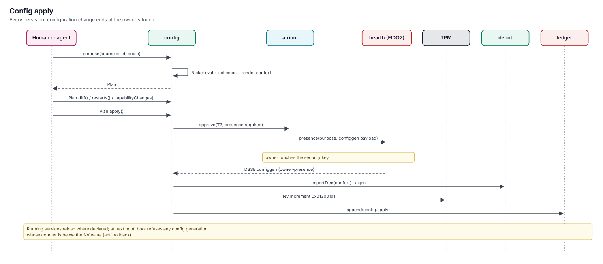

# Config generations

> System configuration on keylos is a Nickel source tree in git, compiled into a read-only `/etc` image and a Cedar policy image. Both are signed with the owner's FIDO2 touch and anchored in a TPM counter.
> Nothing else can change persistent system configuration: not root-equivalent malware, not an agent, not a package. Specified (v1.0).



## Why generations instead of editing `/etc`

| Problem with mutable `/etc` | keylos answer |
|---|---|
| Malware persists by editing a service config or adding a unit | `/etc` is a verity-protected image; a new one needs an owner signature |
| Configuration drifts from what anyone intended | The source is the truth; drift is limited to app-level settings and is reported |
| Rolling back is guesswork | Every applied generation is kept and can be re-applied |
| Nobody can tell what a change will do | Every change is a plan with file diffs, restarts and capability changes in plain language |
| An old, weaker configuration can be replayed | A TPM NV counter rejects any statement older than the latest |

## Source

```
machine.ncl          entry point; selects hosts/<hostname>.ncl
hosts/atlas.ncl      this machine's settings
common/*.ncl         owner modules shared across machines
apps.ncl             installed apps and their persistent grants
policy/*.ncl|*.cedar structured or hand-written policy
secrets.ncl          secret references (vault item names), never values
config.lock          pinned schema library, compiler and fleet modules
```

Example host file:

```nickel
{
  system.hostname = "atlas",
  net.wifi.known.home = { ssid = "home", credential = secret.ref "wifi/home", trusted = true },
  strata.backup.targets.nas = { uri = "sftp://backup@nas.lan/keylos", passwordSecret = "strata/backup/nas" },
  policy.permits = [
    { id = "editor-docs", principal.generationName = "org.example.Editor",
      action = "read", resource.path = "~/Documents", tier = 't0, doc = "Editor reads Documents" },
  ],
}
```

## Modules and merging

Each component ships a schema module declaring its options with Nickel contracts, plus a render function that produces its native files. Setting an undeclared option is an error. Values merge by priority:

| Source | Priority |
|---|---|
| Schema defaults | lowest (`default`) |
| Profile (desktop, server, appliance) | −10 |
| Owner modules and host file | normal |
| Explicit overrides | 10 |
| Fleet-locked options | `force` (cannot be overridden locally) |

## From source to running system

| Step | Where | Output |
|---|---|---|
| 1. Evaluate | `config-eval`: sealed, no network, read-only source, 2 GiB / 120 s | Rendered tree (files, services, grants, policies, secret consumers) |
| 2. Build | `config` | Config generation (EROFS, `/etc`) and policy generation (Cedar), digests computed |
| 3. Plan | `config` | File diffs, service reload/restart list, capability changes, proposer |
| 4. Approve | `atrium` trusted path + FIDO2 via `hearth` | Configgen statement signed by owner presence |
| 5. Commit | `config` + TPM | NV counter +1, generations imported into `depot`, statement written, receipt |
| 6. Activate | `config` + `warden` + `broker` | `/etc` swapped atomically; policy loaded; services reloaded or restarted |
| 7. Verify | `config` | Health checks; on failure, previous generation re-activated |

The same source revision always produces byte-identical generations, so two machines with the same source can be compared by digest.

## Plans in plain language

```
Apply configuration 3f2a91c (proposed by you)
  Files       /etc/net/net.toml  (+2 −1)
  Services    net: reload
  Capabilities
   • Editor (org.example.Editor) will be able to read ~/Documents without asking (new persistent grant).
   • Service net gains access to secret wifi/home (new).
  Touch your security key to apply.
```

## Anti-rollback

Each statement carries `counter = NV + 1`, where NV is the TPM config counter at `0x01300101`. config increments the counter only after the signed generation is durably in the store, so a crash leaves at most a statement one ahead of the counter. At boot, `boot` selects the **highest-counter** statement that verifies against the owner registry anchored in NV `0x01300105` and has `counter ≥` the NV value. If none qualifies, it boots the safe config shipped in the OS generation. After a failed activation, config records a signed `config.activation-rollback` so the previous generation is selected again.

Restoring an old disk image with an old statement doesn't help an attacker; `boot` drops to safe mode.

## Revert

`config revert <gen>` creates a new plan whose rendered tree equals the old generation. It gets a new counter value, because the counter only moves forward. History shows both the original and the revert.

## Agent proposals

Agents edit the config repo inside their workbench and submit it through `aide`. The resulting plan:
- cannot be applied by the agent;
- is flagged as **self-escalation** if it widens the authority of the proposing agent's own template;
- waits for the owner, who runs `config plan show <plan>` and then `config plan apply <plan>` with a touch.

## Drift and adopt

`/etc` cannot drift, because it is verified on every read. Apps still write their own settings into their config subvolume.

| Command | Purpose |
|---|---|
| `config drift` | Checks `/etc` and policy match the current statement, services run the expected generations, and lists apps whose settings diverge from declared defaults |
| `config adopt <app>` | Turns an app's current settings into a Nickel patch you can commit, so the next machine gets them declaratively |

## Secrets

Configuration names secrets; it never contains them:

```nickel
credential = secret.ref "wifi/home"
```

The compiler rejects private keys, common token formats and high-entropy strings in ordinary options. Services read secrets from `vault` at runtime, and the plan lists which services gain access to which secret names.

## Limitations

- Every apply needs a FIDO2 touch. That is intentional, and there is no unattended apply on single-owner machines. Fleet-managed servers use fleet modules with locked options, but the local owner still signs.
- App settings are only adoptable for formats the app declares (JSON, TOML, INI/keyfile, dconf).

## Related

- [config specification](../../specs/config/spec.md)
- [Snapshots and transactions](snapshots-and-transactions.md)
- [ADR-0021: Nickel configuration](../11-decisions/adr-0021-nickel-configuration.md)
- [ADR-0022: read-only /etc via confext](../11-decisions/adr-0022-read-only-etc-confext.md)
- [ADR-0011: owner presence (FIDO2)](../11-decisions/adr-0011-owner-presence-fido2.md)
- [ADR-0029: agents propose, humans sign](../11-decisions/adr-0029-agents-propose-humans-sign.md)
