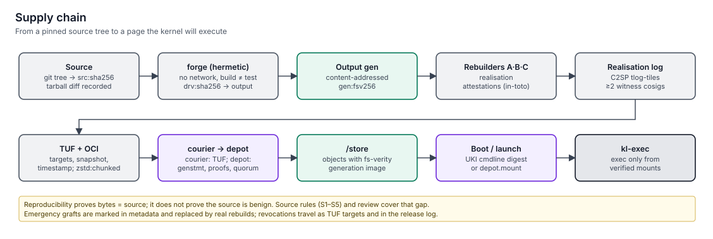

# Key ceremonies

> keylos's trust rests on a small set of keys held by different parties: the project's release and TUF keys, independent rebuilders and witnesses, and each owner's FIDO2 and recovery keys. This page describes who holds what, how keys are used in ceremonies, and how they are rotated or revoked.
> Status: **specified (v1.0)**. Normative spec: [keylos](../../specs/keylos/spec.md) §4.4.6 and §4.11.

## Who holds what

| Key | Holder | Storage | Signs | Rotation |
|---|---|---|---|---|
| TUF root (`distro-root`) | 5 holders from ≥ 3 organisations | Offline HSMs, 3-of-5 | TUF delegations, stream keys | Yearly; immediately on compromise |
| Release stream (`stable`, `beta`) | Project release managers | HSM, two-person ceremony | UKIs, OS and distro generation statements, PCR policy, revocations, release statements | Per policy or compromise; rotation raises the TPM floor |
| Release stream (`dev`) | Project CI | Online HSM | Developer builds | Never trusted by default installs |
| Rebuilder (`rebuilder/<op>`) | ≥ 3 independent operators | Operator HSMs | Realisation attestations | Operator-managed; announced in governance statements |
| Witnesses | ≥ 4 public witnesses (+ optional vouch phones) | Witness-managed | Log cosignatures | Witness-managed |
| Owner FIDO2 (×2) | The owner | Security keys | Config, seals, policy, T3 mandates, key enrolment | Owner adds/removes; see [lost key](runbooks/lost-fido2-key.md) |
| Owner PK / KEK / db | The owner | PK wrapped by recovery key; KEK and db TPM-resident behind presence | Secure Boot variable updates | Rare |
| Recovery key | The owner | Paper | Unlock and re-enrolment | On reinstall or suspected exposure |
| Service keys (`service/<name>`) | Each tier-0 service | TPM | Receipts | Recreated on reinstall |

**Separation rule:** no single organisation can change the TUF root, publish an OS generation that meets the rebuilder quorum, *and* supply a quorum of witness cosignatures. Getting a malicious release onto machines requires collusion across independent parties, and it would be visible in the logs.

## Release signing ceremony

Run for every `stable` and `beta` release:

1. **Independent assembly.** Two builders assemble the release from the same `assembly.lock`. `keylos-image verify-repro` must report identical unsigned artifacts.
2. **Quorum check.** Every derivation in the closure has realisation attestations from the stream's quorum of rebuilders, included in the realisation log.
3. **Ceremony host.** An offline `server`-profile keylos machine with the HSMs attached. Two key holders are present: an **operator** and a **verifier**.
4. **Digest check.** The verifier reads every digest the operator's screen shows from an independently built draft: UKI, OS generation, PCR predictions, revocation list serial, TUF targets.
5. **Signing.** PE signatures on UKIs, generation statements (`keylos.genstmt/1`) for the OS and distro generations, the PCR policy, the IPE policy (`kernel-policy/<stream>`), the TUF targets and the DSSE release statement (`keylos.release/1`). There are no per-object fs-verity signatures: integrity of every object follows from the signed generation digest.
6. **Publication order.** The release statement goes into the release log *first*. TUF targets are signed only after inclusion. Nothing is ever distributed unlogged.
7. **Transcript.** Commands, digests and operator identities are published as part of the release statement.

## TUF root rotation

1. Each holder independently reviews the new `root.json`: new keys, thresholds and expiry.
2. 3-of-5 old-root signatures and 3-of-5 new-root signatures are collected at separate locations. The keys never meet in one place.
3. The new root is published as a TUF root version and a governance statement in the release log.
4. Clients rotate automatically through the TUF chain of trust.

## Stream key compromise (drill twice a year)

| Step | Effect |
|---|---|
| Emergency TUF root signing: revoke the stream key, add a new one | Clients stop trusting the old key for new metadata |
| Revocation list `keys` entry | Generations signed only by the old key become `unlaunchable` (apps) or are refused for staging (OS) |
| Next UKI raises the OS floor and carries the new PCR-policy key | Old UKIs can no longer unseal disks after the next successful update |
| Advisory in the release log | Owners and fleets are informed |

## Governance changes

- Adding or removing a TUF root holder, rebuilder operator or witness is a signed **governance statement** in the release log. It takes effect at least 14 days later.
- Emergency removal after compromise takes effect immediately.
- If the rebuilder quorum for `stable` is lost, regular stable releases pause. Security point releases may proceed with the remaining operators, plus a public notice.

## Owner-side ceremonies

| Ceremony | When | Touches |
|---|---|---|
| Install | Once | 2 (registration) + 1 (first config) + 1 (owner-seal self-test) |
| Add a FIDO2 key | Any time | 1 with an existing key + 1 with the new key |
| Pair a phone | Any time | 1 (config generation adding the phone) |
| Seal a tool | When promoting code to the host | 1 per 10-minute window, scoped to one project |
| Config change | Each apply | 1 |
| Rotate recovery key | After suspected exposure, or to revoke trustee shares | Recovery key + 1 |
| Split recovery key into trustee shares | Once, optional | 1 (purpose `trustee.split`) |
| Add or remove an owner | Any time | Owner-registry quorum; re-creates the owner Secure Boot KEK/db signers and re-enrols them in firmware |
| Switch to quorum presence (headless) | At install, or when a machine becomes headless | `set-quorum` entry signed by the current `policy.quorum` owners |
| Keep Microsoft CAs for dual boot | When dual booting | 1 (config) + firmware enrolment (`HearthTpm.sbSign`, purpose `boot.sb-sign`) |
| Approve a quorum request | Each presence action on a headless machine | 1 per approver, on the approver's own machine |

## Limitations

- Owner key ceremonies depend on the owner keeping the recovery key safe and offline. keylos cannot enforce that.
- Hardware option-ROM changes, such as a new GPU, may require re-running owner `db` enrolment with the KEK. That is a presence action.

## Related

- [Install and enrolment](install-and-enrolment.md)
- [keylos distribution spec](../../specs/keylos/spec.md)
- [Supply chain](../05-integrity/supply-chain.md)
- [ADR-0016: Rebuilder quorum and transparency logs](../11-decisions/adr-0016-rebuilder-quorum-and-transparency-logs.md)
- [ADR-0017: TUF over OCI](../11-decisions/adr-0017-tuf-over-oci.md)
