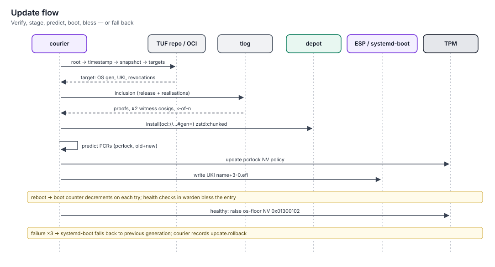

# Updates and rollback

> How a keylos machine finds, verifies, stages and boots a new release, how it decides a boot was good, and how to roll back.
> Updates are A/B boot entries with automatic fallback. Nothing is staged that the transparency logs and the rebuilder quorum have not confirmed.

**Status:** specified (v1.0). Owned by [courier](../../specs/courier/spec.md); boot-side mechanics in [boot](../../specs/boot/spec.md); object fetching by [depot](../../specs/depot/spec.md).



## What courier checks before staging

| # | Check | Protects against |
|---|---|---|
| 1 | TUF metadata: root chain, thresholds, expiry, version monotonicity, snapshot consistency | Compromised mirrors, rollback, freeze attacks |
| 2 | The release document is a target of the stream's delegation | Unauthorised releases |
| 3 | The release-log entry exists, with an inclusion proof against a checkpoint cosigned by ≥ 2 witnesses | Targeted (split-view) releases |
| 4 | ≥ k of n independent rebuilders attest the same OS generation digest and derivation, each in the realisation log | A compromised build farm |
| 5 | Every downloaded object matches its fs-verity digest; the generation matches its digest | Corrupted or substituted content |
| 6 | The UKI's SHA-256 matches the release; its signature verifies | Substituted boot images |
| 7 | Capability diff: new services, privileged services, policy-default changes | Silent widening of authority (requires approval with presence) |

## Staging steps

```
check → verify → fetch (depot, zstd:chunked deltas) → UKI download + verify
      → predict PCRs for the new boot → write pcrlock policy (old + new + rollback branches)
      → write keylos_<seq>+3-0.efi to the ESP → "Restart to finish updating"
```

Every step is idempotent. A crash at any point leaves the current entry bootable.

## Boot assessment

After a reboot into the new entry, `courier` waits up to 5 minutes for:
- all boot services running for 60 s with no restarts;
- a ledger checkpoint after boot;
- the greeter or a session rendered (graphical profile).

| Result | Actions |
|---|---|
| Good | Entry renamed without its counter; PCR11 `ready`; generations rooted as known-good; floor raised per policy; `update.commit` receipt |
| Bad, or the boot loader fell back to an older entry | Failed entry marked exhausted; `update.rollback` receipt with `boot-failed`; critical notification |

systemd-boot counts tries: each failed boot decrements the counter in the file name, and after three failures the next entry boots automatically.

## The release floor

The floor is the lowest release `seq` that can unlock the disk. It lives in TPM NV `0x01300102` (8 bytes) and never goes down. Each release declares its floor F in its signed statement, and the release-stream key authorizes exactly one floor write per release UKI: "set the floor to F, only while this UKI is booted, only if the current floor is ≤ F" ([Boot chain](../05-integrity/boot-chain.md#the-release-floor), [ADR-0060](../11-decisions/adr-0060-exact-target-floor-authorization.md)).

| Event | New floor |
|---|---|
| Healthy boot of release N | Exactly F of N (release tooling picks F so one older good release normally stays bootable) |
| Current floor already ≥ F | Unchanged (the TPM refuses the write) |
| Owner pins a release below F | Unchanged while pinned; courier never writes an intermediate value |
| TPM cleared or floor unreadable | Recovery re-enrolment sets a new baseline from the signed release statement |

## Rollback

| Want | Command | Approval |
|---|---|---|
| Boot the previous good release from now on | `courier rollback` | T2 (T3 if older than 30 days) |
| Keep a release bootable while testing | `courier pin <seq>` | T2 |
| See entries and their state | `courier entries` | none |
| Boot something else once | Choose it in the boot menu (hold Space at power-on) | none |

Rollback is impossible below the floor, by design: those releases are considered vulnerable.

## App updates

`courier` is the only TUF client ([ADR-0046](../11-decisions/adr-0046-courier-sole-tuf-client.md)). It also checks installed apps against their publishers' TUF delegations, and resolves app installs for depot through `CourierResolver`:
- updates that keep or narrow the capability set become the default immediately (running instances keep the old version until restart);
- updates that widen it stay non-launchable until you approve the rendered diff.

## Firmware updates

Firmware goes through fwupd, which runs confined in a private D-Bus island with no network. `courier` fetches and verifies the LVFS metadata. Applying firmware:
1. requires approval with presence;
2. leaves PCR0 and PCR2 out of the unlock policy for exactly one boot (firmware measurements cannot be predicted);
3. re-locks the policy to the new measured values after a good boot;
4. records the window in a receipt.

Verify that boot with your phone.

## Secure Boot database changes

| Change | Order | Approval |
|---|---|---|
| Add a new release-signing certificate to `db` | First, then one good boot with a UKI signed under it | Presence (owner KEK is TPM-held) |
| Revoke an old certificate in `dbx` | Only after the step above; refused if it would revoke the current or newest good UKI | Presence |
| SBAT level (shim mode) | Only after a good boot with a shim that already satisfies the new level | Presence |
| dbx updates on `shared-boot` machines | Same staged order; Microsoft-signed components revoked by the vendor are applied promptly, since they are in this machine's trust base | Presence |

Owner KEK and db signing goes through `HearthTpm.sbSign` with a presence envelope of purpose `boot.sb-sign`; hearth is the only holder of owner-hierarchy operations.

## Offline operation

Freshness is tracked as **revocation age**: time since the newest verified revocation list, measured against NTS time or the ledger's time floor ([ADR-0056](../11-decisions/adr-0056-offline-mode.md)).

| Condition | Behaviour |
|---|---|
| TUF timestamp expired | Updates pause; installed generations keep launching; `kish status` shows the revocation age |
| Revocation age > 30 days | New third-party installs need T3; newly imported legacy images run in tier 2; agents need T2 to reach hosts their template hasn't contacted before; policy sees `offline_days` |
| Always | Generation statements issued more than 24 h after trusted time are rejected |

Revocation lists reach `depot` through courier (`Resolution.revocations`), so they arrive with every resolution, not only with OS updates.

## Offline and media updates

From the recovery environment, `courier stage --from-media /path` stages a release from removable media. Air-gapped sites can also ship signed TUF metadata and revocation lists on media to reset the revocation age. The same TUF, log and quorum checks apply against the metadata bundle on the media, plus a freshness warning when the bundle's timestamp role has expired.

## Limitations

- After 7 days without fresh TUF metadata, staging is refused (freeze-attack protection) until the network returns or media with fresh metadata is used.
- A release cannot be staged while the rebuilder quorum is incomplete, even for urgent fixes. Urgent fixes are released as temporary grafts that still go through the quorum.

## Related

- [Boot chain](../05-integrity/boot-chain.md)
- [Transparency and rebuilders](../05-integrity/transparency-and-rebuilders.md)
- [Boot to desktop](../02-architecture/boot-to-desktop.md)
- [courier spec](../../specs/courier/spec.md)
- [ADR-0017 TUF over OCI](../11-decisions/adr-0017-tuf-over-oci.md), [ADR-0016 Rebuilder quorum and transparency logs](../11-decisions/adr-0016-rebuilder-quorum-and-transparency-logs.md), [ADR-0018 Grafts are temporary](../11-decisions/adr-0018-grafts-are-temporary.md)
