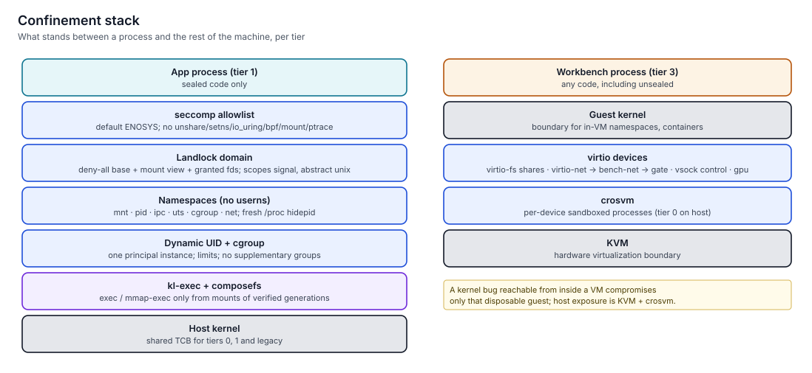

# Port a legacy app

> Start by running the software unmodified through compat (tier 2, in a VM). Then, if it is worth it, make it a forge-built legacy image (tier L on the host) or a native app (tier 1). Each step removes overhead and makes its authority more explicit.

**Status:** specified (v1.0). See [compat](../../specs/compat/spec.md) and [sdk](../../specs/sdk/spec.md).



## The ladder

| Step | Placement | What you change | Typical cost |
|---|---|---|---|
| 1. Import as is | Tier 2 VM | Nothing | ~0.5 s start, ~150 MB |
| 2. Forge-built legacy image | Tier L host | A forge recipe that builds from source with an FHS layout | ~40 ms start; reproducibility work |
| 3. Native app | Tier 1 host | `package.ncl`, use the sdk powerbox and portals, remove D-Bus/X11 assumptions | Lowest overhead, smallest authority |

## Step 1: import and observe

```sh
$ compat import distro:debian:trixie --packages inkscape --name inkscape
$ compat run inkscape
$ compat permissions inkscape
```

Use the app normally, then look at what it needed:

```sh
$ ledger query --subject 'legacy:*inkscape*' --events legacy.open,x-compat.bridge,grant.issue
```

That shows which files it opened through prompts (`legacy.open`), which D-Bus APIs it bridged (`x-compat.bridge`, a compat-specific event), and which hosts it reached. This becomes your capability list.

## Step 2: build it with forge

1. Write a recipe in `pkgs` style that builds from pinned sources into an FHS tree (`/usr/bin`, `/usr/lib`, …), and declare `kind = legacy-image` with a `compat` object:

   ```nickel
   compat = {
     origin = { format = 'forge, internet = false },
     entrypoints = { main = { exec = "/usr/bin/inkscape" } },
     open_broker = 'prompt,
     x11 = false,
     dbus = { session = true, bridge = ["org.freedesktop.portal.FileChooser", "org.freedesktop.Notifications"] },
   }
   ```

2. Build and check reproducibility:

   ```sh
   $ kl-sdk build && kl-sdk inspect --json | jq .reproducible
   ```

   It must be reproducible, and signed by a release-stream or publisher key, to run in tier L. Non-reproducible builds stay in tier 2.

3. Publish through the catalogue so rebuilders confirm it ([Package an app](package-an-app.md) steps 8–9).

## Step 3: make it native

| Legacy habit | Native replacement |
|---|---|
| Reads `~/.config/app/*` | `$XDG_CONFIG_HOME` (the app's own subvolume) |
| Opens files by path from a dialog | `app.pick_file()`: you get an fd |
| Saves next to the original | `app.save_file(suggested)` |
| X11 | Wayland (GTK4/Qt6 already are); `needs.gpu = "display"` |
| D-Bus portals | Keep them with `needs.portalIsland = true`, or call `keylos-sdk` portals directly |
| Spawns helpers with `system()` | Declare `needs.spawn` and use `Supervisor.spawn` through the sdk |
| Reads tokens from env or files | `app.secret(name, purpose)` |
| Telemetry to arbitrary hosts | Declare each host in `needs.network` with a `why`, or remove it |

Then follow [Package an app](package-an-app.md).

## Checklist before moving down the ladder

- [ ] Every host the app contacts is listed with a reason
- [ ] No reads outside its XDG directories, except through the powerbox
- [ ] No setuid helpers or capabilities needed
- [ ] Builds reproducibly (two clean builds give the same `gen:` digest)
- [ ] Tests pass under `kl-sdk test --tiers`

## Related

- [Legacy apps](../09-experience/legacy-apps.md)
- [compat spec](../../specs/compat/spec.md)
- [Package an app](package-an-app.md)
- [ADR-0037 Legacy tier with FHS views](../11-decisions/adr-0037-legacy-tier-fhs-views.md)
- [ADR-0043 Non-reproducible means tier 2](../11-decisions/adr-0043-non-reproducible-means-tier-2.md)
