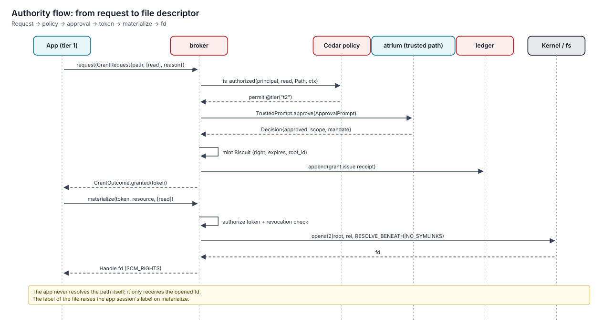

# Write a service

> A service is a `service` generation started by warden. It exposes capwire interfaces to callers through routes, and holds only the routes, fds and grants its manifest declares. This guide builds a small on-demand service and wires it into the system configuration.

**Applies to:** `kind = service`. Specified in [sdk](../../specs/sdk/spec.md) §4.1 (ServiceSpec) and [protocols](../../specs/protocols/spec.md) §7.



## 1. Define the interface

Services speak Cap'n Proto over capwire. Allocate your own file ID (`capnp id`) and keep ordinals stable forever.

```capnp
@0xe1a2b3c4d5e6f701;
using C = import "/keylos/common.capnp";
interface Thumbnailer {
  thumbnail @0 (image :C.Fd, maxPx :UInt16) -> (png :C.Fd);
}
```

Pass data as fds, not paths. Your service never opens a caller's path.

## 2. Create the project

```sh
$ kl-sdk init service-rust ~/src/thumbnailer --name org.example.Thumbnailer
```

```nickel
{
  name = "org.example.Thumbnailer", version = "1.0.0", kind = 'service,
  summary = "Image thumbnails", license = "MIT",
  build = { language = 'rust, lockfiles = ["Cargo.lock"] },
  entrypoints = { main = { exec = "/usr/bin/thumbnailer", kind = 'service } },
  service = {
    start = 'on-demand,
    exposes = [{ interface = "0xe1a2b3c4d5e6f701", facets = ["user"] }],
    routes = [],                       # calls no other services
    limits = { memory_mib = 256, pids = 16 },
    writable_state = false,
  },
} | (import "keylos/package@1").PackageSchema
```

## 3. Implement it

```rust
#[keylos_sdk::service(facets = ["user"])]
impl thumbnailer::Server for Thumbnailer {
    async fn thumbnail(&mut self, ctx: Ctx, image: OwnedFd, max_px: u16) -> Result<OwnedFd> {
        let caller = ctx.peer();                          // principal warden named in ServiceHost.accept
        let img = decode_limited(image, 64 << 20)?;       // treat input as hostile: size limits
        let out = memfd("thumb")?; encode_png(resize(img, max_px), &out)?;
        tracing::info!(peer = %caller, "thumbnail");
        Ok(out.into())
    }
}
```

**Rules:**

| Rule | Why |
|---|---|
| Identify callers only through `ctx.peer()` | Never trust claims in messages |
| Parse untrusted input with limits | Treat input as hostile |
| Return `kl:<code>` errors (`Error::denied("…")`, `Error::invalid("…")`) | Callers see consistent failures |
| No path resolution for callers | Use the fds they pass (I7) |

## 4. Test

```sh
$ kl-sdk build && kl-sdk test
```

`kl-sim` spawns your service with a socket route and calls it from the scenario's client steps.

## 5. Install and route it

Services are started by warden only when the system configuration routes something to them. Add the service in the config repository:

```nickel
# config/services.ncl
{
  services."org.example.Thumbnailer" = {
    generation = "org.example.Thumbnailer@1.0.0",
    routes_in = [{ from = "app:name=org.example.Notes", facet = "user" }],
  },
}
```

```sh
$ config propose ~/config     # shows the plan: new service, new route, capability changes
$ config apply                # T3 + presence: config generations are owner-signed
```

## 6. Observe

| What | Where |
|---|---|
| Logs | `journal` under `service:org.example.Thumbnailer:…` |
| Spawn and exit receipts | Written by warden |
| Grants your service requested | Receipted by broker |

## Related

- [protocols spec, §7 capwire](../../specs/protocols/spec.md)
- [sdk spec](../../specs/sdk/spec.md)
- [Write policy](write-policy.md)
- [ADR-0004 capwire, no system bus](../11-decisions/adr-0004-capwire-no-system-bus.md)
- [ADR-0022 Read-only /etc via confext](../11-decisions/adr-0022-read-only-etc-confext.md)
