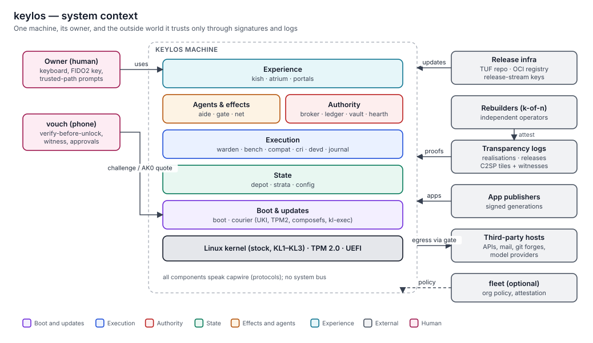
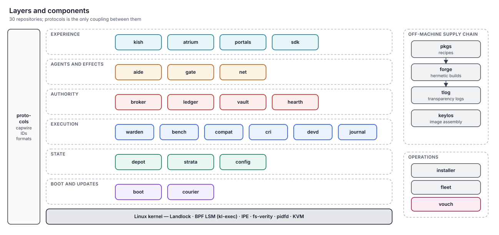
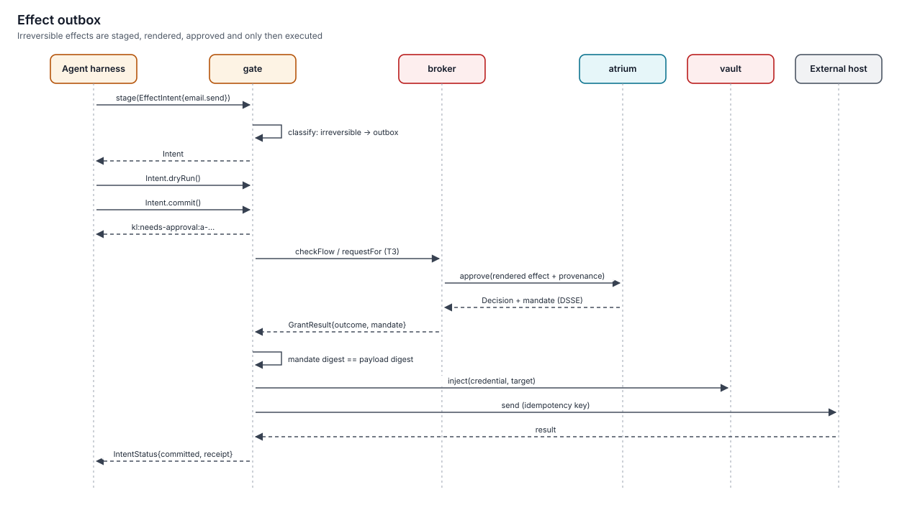
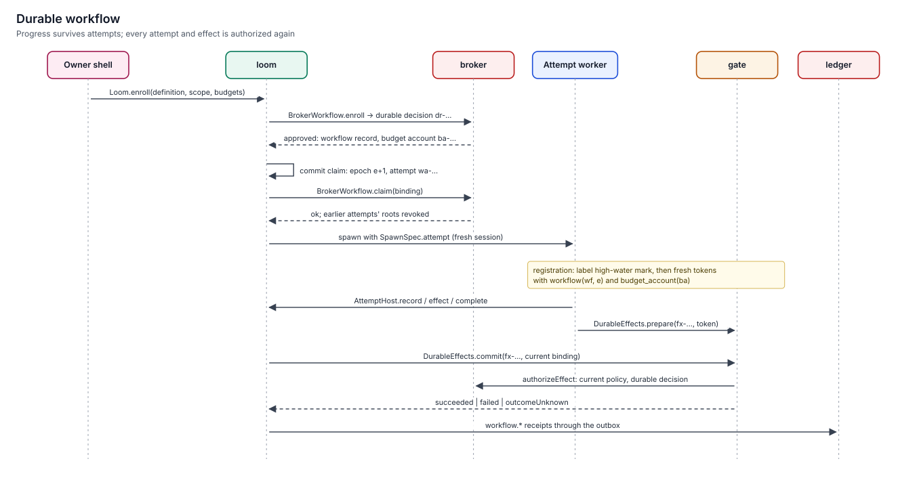
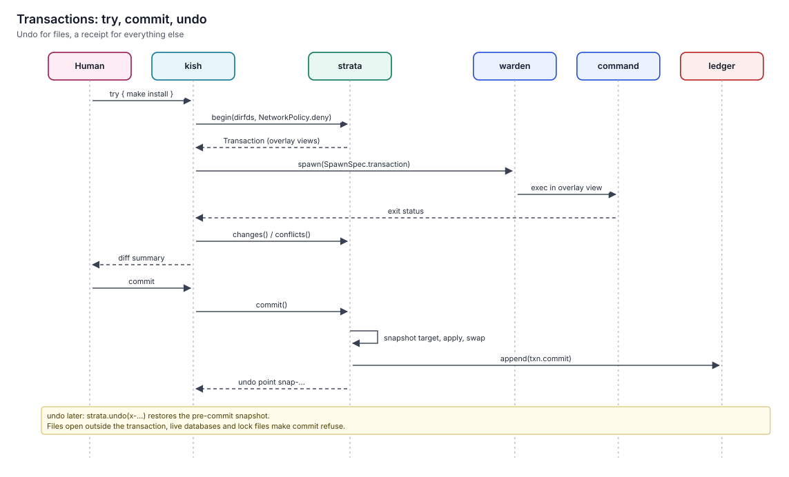
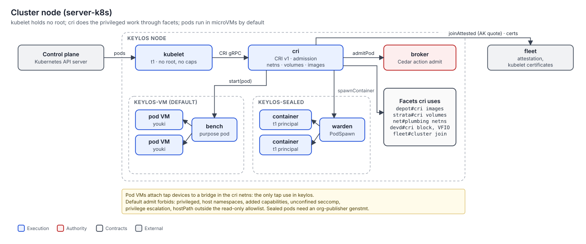

# Diagrams

> Every diagram in the handbook, in one gallery. All are generated deterministically by `scripts/diagrams.py` (`make diagrams`).
> Static diagrams show structure; sequence diagrams use the method names of the protocols schemas.

## Structure

### System context

Used in: [Handbook landing page](../README.md), [System context and layers](../02-architecture/system-context-and-layers.md).

### Layers and components

Used in: [Architecture](../02-architecture/README.md).

### Repository dependencies

Used in: [Dependency rules](../02-architecture/dependency-rules.md).

### Process tree and tiers

Used in: [Process tree and tiers](../02-architecture/process-tree-and-tiers.md).

### Confinement stack

Used in: [Confinement tiers](../06-security/confinement-tiers.md).

### Store and composefs

Used in: [Exec integrity and sealing](../05-integrity/exec-integrity-and-sealing.md), [Supply chain](../05-integrity/supply-chain.md).

### Labels and the Rule of Two

Used in: [Labels and the Rule of Two](../06-security/labels-and-rule-of-two.md).

## Chains

### Boot chain

Used in: [Boot chain](../05-integrity/boot-chain.md).

### Supply chain

Used in: [Supply chain](../05-integrity/supply-chain.md).

## Flows

### Authority flow

Used in: [Authority flow](../02-architecture/authority-flow.md).

### Powerbox

Used in: [Portals and the powerbox](../09-experience/portals-and-powerbox.md).

### Agent session

Used in: [Agent session flow](../02-architecture/agent-session-flow.md).

### Effect outbox

Used in: [Effects and the outbox](../07-agents/effects-and-outbox.md).

### Durable workflow

Used in: [Durable workflows](../08-state/durable-workflows.md).

### Config apply

Used in: [Config generations](../08-state/config-generations.md).

### Transactions: try, commit, undo

Used in: [Snapshots and transactions](../08-state/snapshots-and-transactions.md).

### Verify before unlock

Used in: [Attestation and vouch](../05-integrity/attestation-and-vouch.md).

### Update flow

Used in: [Updates and rollback](../10-operations/updates-and-rollback.md).

### Cluster node

Used in: [Kubernetes nodes](../10-operations/kubernetes.md).

### Removable media

Used in: [Devices and media](../06-security/devices-and-media.md).

## Related

- [Contributing: diagrams](../CONTRIBUTING.md#diagrams)
- [Reference](README.md)
